```{r setup, include = FALSE}
knitr::opts_chunk$set(
  echo = FALSE,
  message = FALSE, 
  warning = FALSE
)
```

This is a brief overview on our project. 

Please find the [full report](Final_Project_Report.html), [screencast](Screencast.html), and the [analysis and code](Analysis_and_code.html) here or from the top of the page.
Please find GitHub repository on the up right corner. 

# Motivation

Diabetes is one of the most prevalent chronic diseases in the United States, affecting over 34 million Americans and placing an estimated $327 billion annual burden on the healthcare system. 

The disease reduces life expectancy and quality of life while contributing to severe complications including heart disease, kidney failure, vision loss, and amputations. 

A significant challenge in diabetes management is underdiagnosis. One in 5 diabetics and 8 in 10 prediabetics are unaware of their condition. Therefore, **early identification of at-risk individuals** enables lifestyle modification and preventive care, potentially mitigating the burden of diabetes. 

```{r}
library(tidyverse)
library(caret)
library(skimr)
library(janitor)
library(corrplot)
library(DataExplorer)
library(ggplot2)
library(pROC)
library(broom)
set.seed(123)
```

# Research Questions

In this project we would like to focus on these three questions: 

1. Which demographic, lifestyle, and clinical characteristics are most strongly associated with diabetes?

2. How effectively can logistic regression models predict diabetes status using only self-reported survey information?

3. Does model complexity like interaction terms improve predictive performance?

# Data

We use the cleaned [2015 BRFSS dataset](https://www.kaggle.com/datasets/alexteboul/diabetes-health-indicators-dataset/data) (253,680 adults, 22 variables), focusing on variables related to demographics, lifestyle, and self-reported health.

- **Population:** Adults participating in the 2015 BRFSS survey.
- **Outcome:** Self-reported diabetes status (binary outcome used for prediction).
- **Main predictors:** BMI, age category, general health rating, blood pressure, cholesterol, smoking status, physical activity, sex, and socioeconomic indicators

## Key preprocessing steps:

- No missing data were present (already cleaned by BRFSS).

- Created interpretable new variables according to [dataset notebook](https://www.kaggle.com/code/alexteboul/diabetes-health-indicators-dataset-notebook) and [codebook](https://www.cdc.gov/brfss/annual_data/2015/pdf/codebook15_llcp.pdf). 

  - BMI categories

  - Mental & physical health categories

  - Composite lifestyle and health-risk scores

  - Converted categorical variables into meaningful factor labels

- Train/test Split

  - 80/20 stratified split is used to preserve diabetes prevalence.
  
  - Training set: approximately 202,944 observations (for EDA and model fitting)
  
  - Test set: approximately 50,736 observations (for final evaluation only)

- Fixed random seed (123) for reproducibility

## Exploratory analysis revealed:

- **Strong class imbalance (far more non-diabetic respondents).**

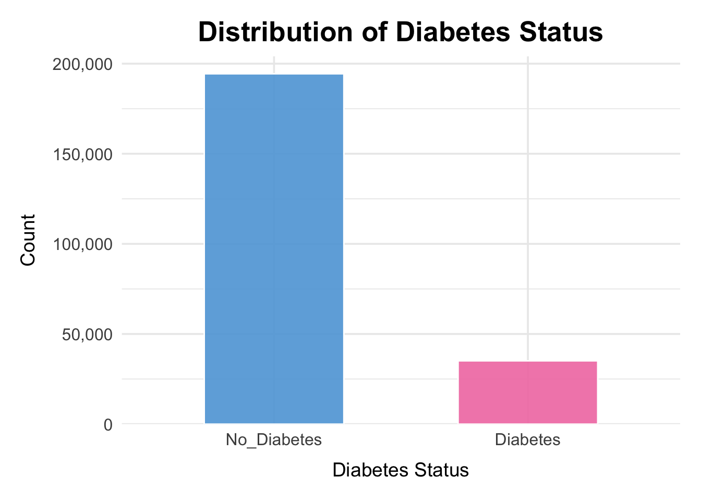

According to this plot, diabetes individual included is much less than non-diabetes. This may lead to strong class imbalance. 

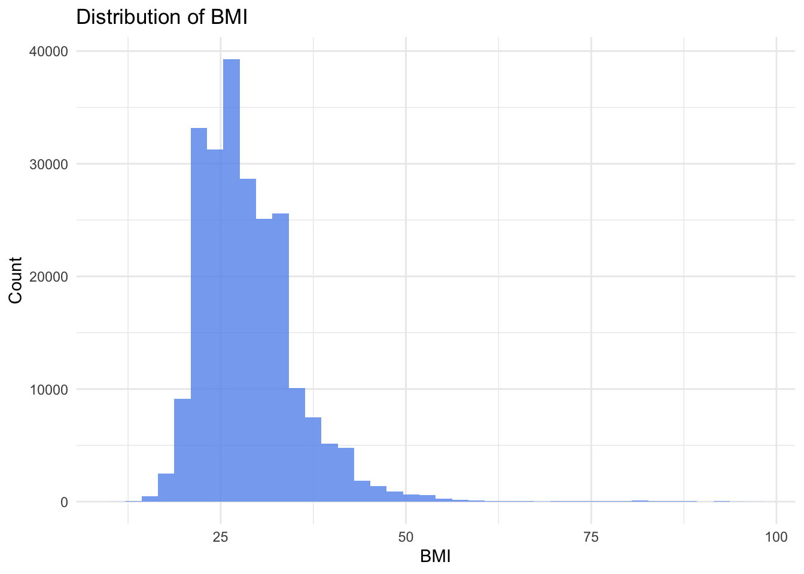

The BMI in this sample is right-skewed, with most values falling between 20 and 40. 

The concentration of observations in the overweight and obese range reflects the population distribution in this dataset. A smaller number of individuals have very high BMI values, forming a long right tail.

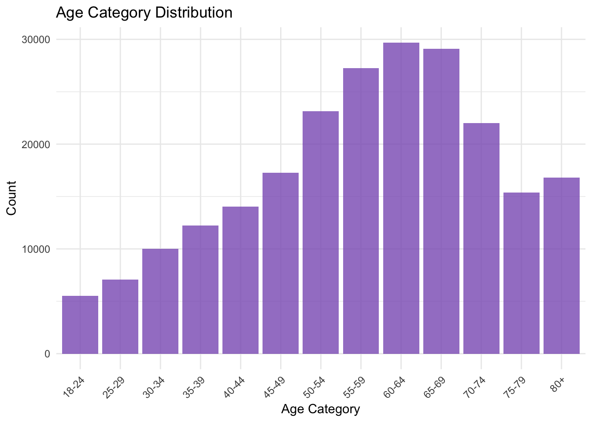

Left-skewness in this plot shows that the dataset contains far more middle-aged and older adults than younger respondents. Counts increase steadily from the 18–24 group and peak between ages 55–69, before gradually declining in the 70+ categories. This uneven age distribution is important because diabetes risk rises with age. This means that the sample naturally contains more individuals from higher-risk age groups.

- **Diabetic individuals tend to have higher BMI, poor general health, and older age.**

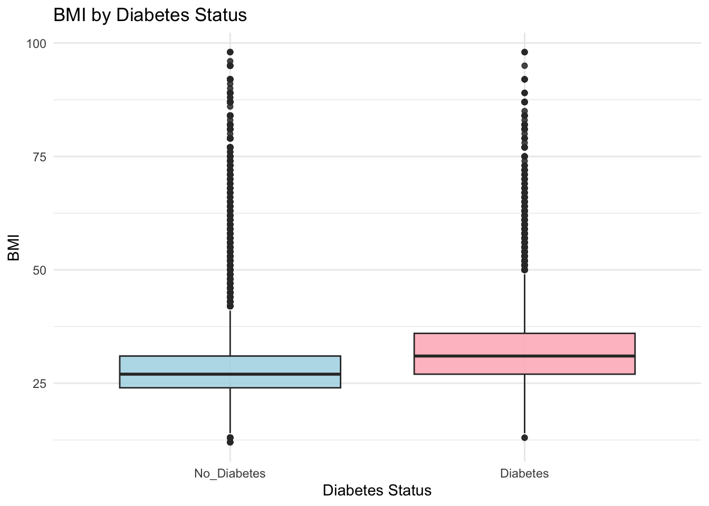

The plot shows that individuals included with diabetes tend to have higher BMI values than those without diabetes. Both the median and overall distribution of diabetes group shifted upward. 

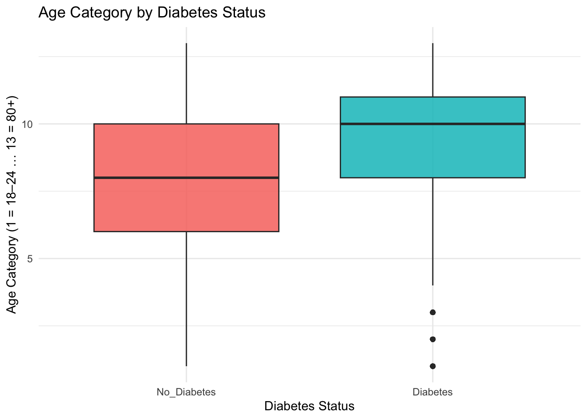

The plot shows that the median age category is higher for the diabetes group, and their overall distribution is shifted toward older age ranges.

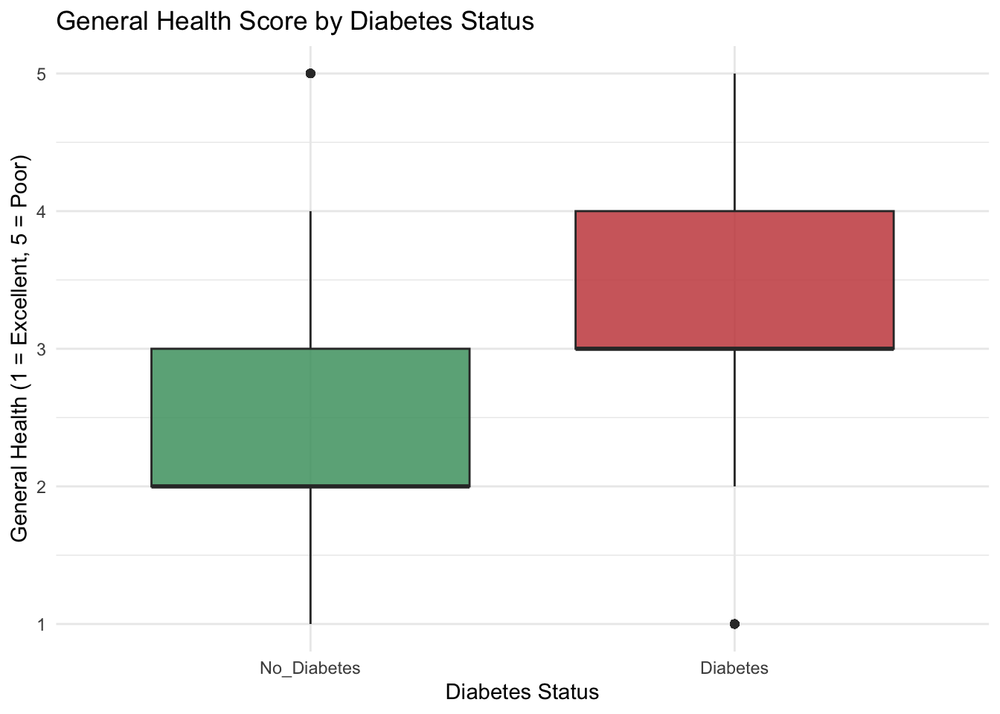

The plot shows that individuals with diabetes generally report worse overall health than those without diabetes. The diabetes group has a higher median health score, which indicates poorer health and a distribution shifted toward less favorable health ratings.

- **Income distribution is skewed toward higher brackets, which may influence access to care.**

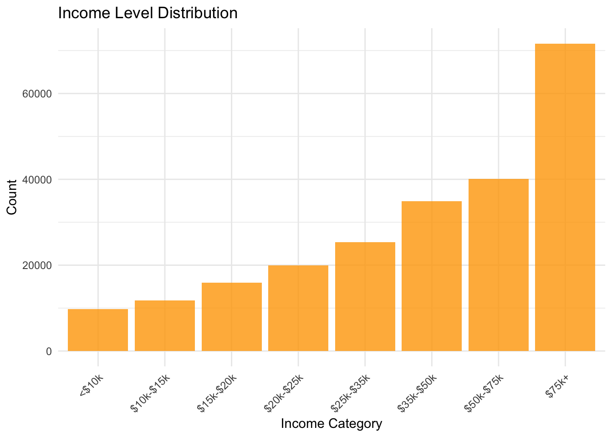

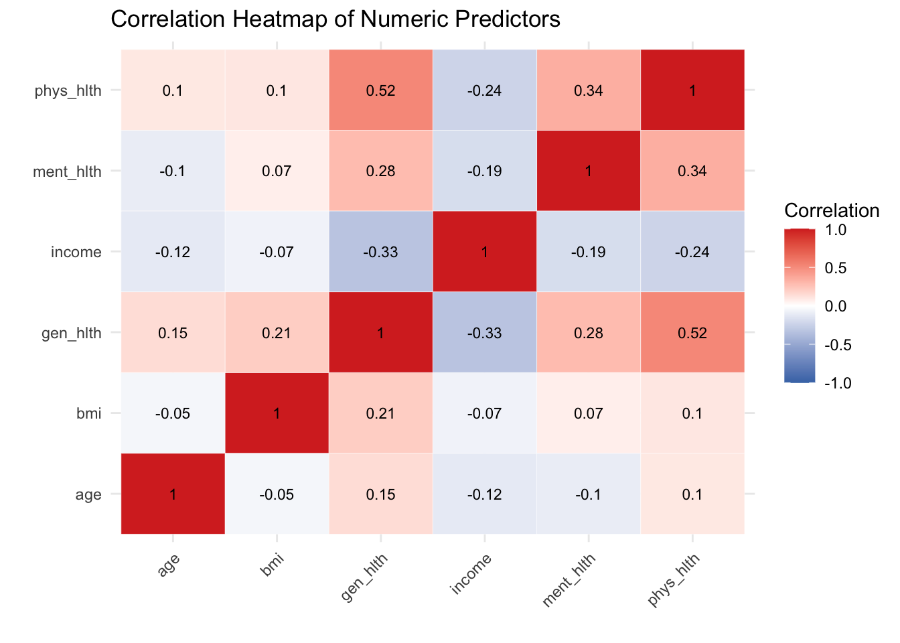

The heatmap shows that correlations among the numeric predictors are generally weak to moderate, indicating low multicollinearity and supporting their joint use in logistic regression models. 

Variables related to overall health, such as general health and physical or mental health days, are moderately correlated as expected,

While BMI and age show only weak relationships with other predictors. 
Overall, the plot confirms that each variable contributes distinct information for diabetes risk prediction.

# Key Findings

## 1. Proposed Model Performed Best

We compared three logistic regression models:

- **Main Effects Model：** containing core demographic and health variables (bmi, age level, general health category, high blood pressure, high cholesterol, physical activity, smoker, heart disease or attack, income level, education level, sex)

- **Subgroup Model：** incorporating an interaction between BMI and Age

- **High-Interaction Model:** adding complex terms for BMI, physical activity, and high blood pressure

The Main Effects Model achieved the highest predictive performance (AUC = 0.806 vs. 0,799 vs. 0.781) and best calibration.

Adding interaction terms did not improve accuracy and sometimes reduced sensitivity, suggesting noise rather than signal was introduced.

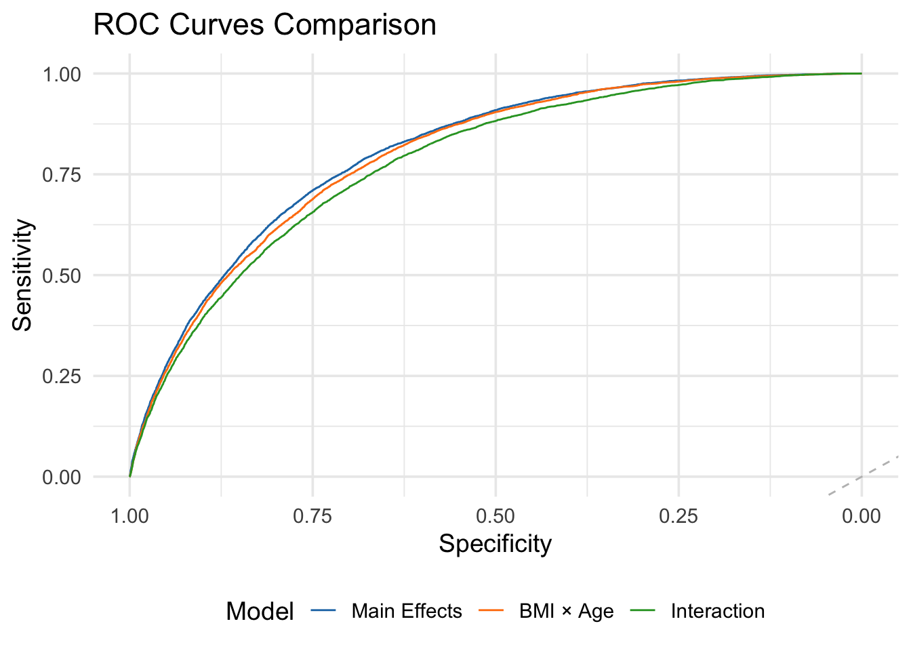

The ROC curves show that the Main Effects model consistently achieves the highest sensitivity across specificity levels. This confirms its better discrimination ability compared with the BMI × Age and High-Interaction models. 

The two more complex models both produce slightly lower ROC curves. Additional interaction terms introduced noise and did not improve predictive performance. 

The simpler Main Effects model is the most effective and reliable choice for diabetes risk prediction.

## 2. Significant Predictors of Diabetes

The variables most strongly associated with diabetes were:

- age
- BMI
- high blood pressure
- high cholesterol
- income

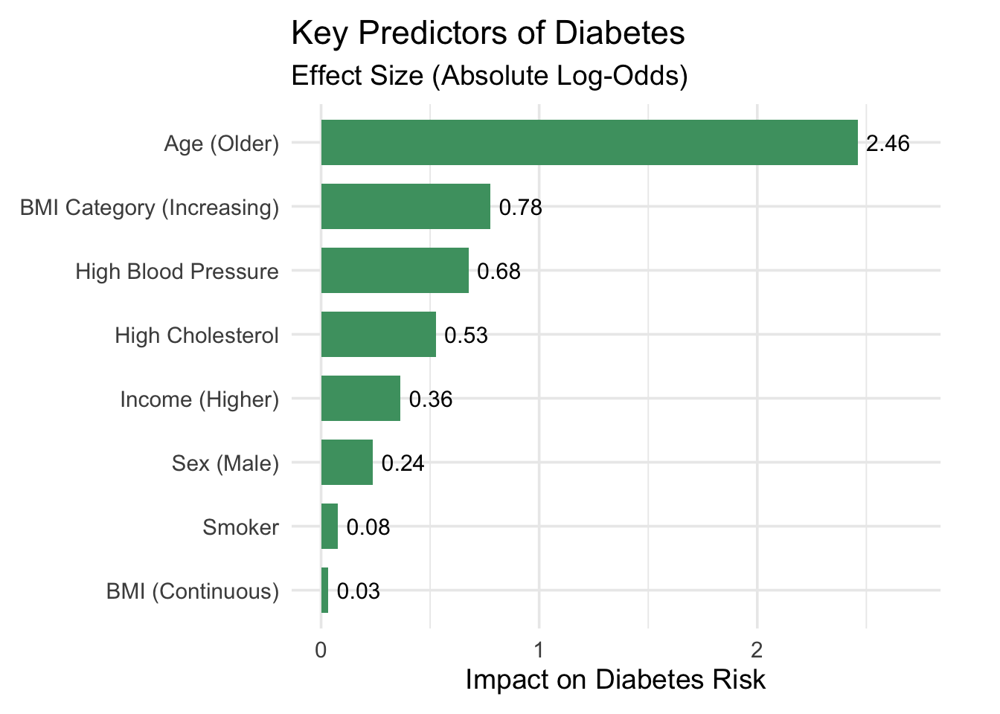

These findings align with established clinical literature, which means they support the external validity of our model.

## 3. Importance of Adjusting the Classification Threshold

Diabetes is relatively rare in this dataset. The default probability cutoff of 0.5 produced **high accuracy (~85%) and dangerously low sensitivity (~15%)**. 

Adjusting the threshold using **Youden’s Index (~0.14)** significantly **improved sensitivity** while maintaining acceptable specificity. This improved the model in ability of identifying high-risk individuals from public health screening.

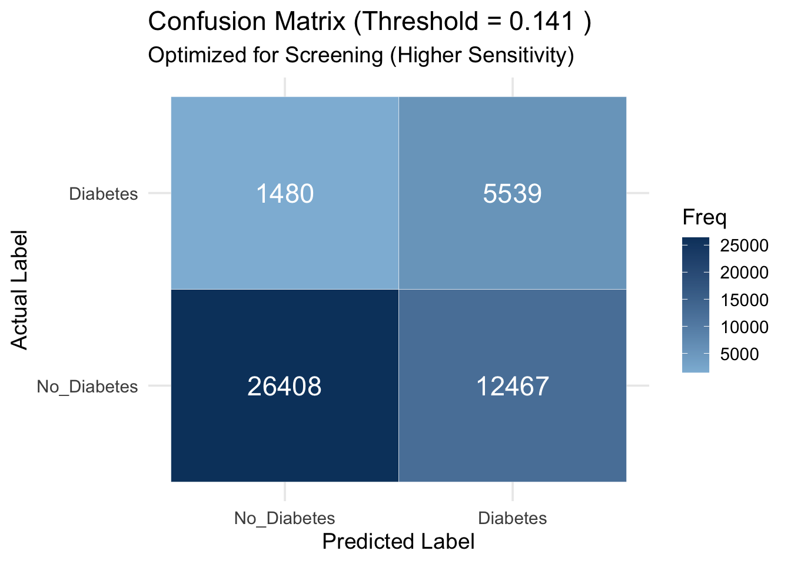

This confusion matrix illustrates the performance of the Main Effects model after lowering the decision threshold to 0.141. 

With this threshold, the model correctly identifies far more true diabetes cases (1,480) than at the default threshold, though at the cost of increasing false positives (12,467). 

This trade-off is more appropriate for screening, as missing true cases is more harmful than referring additional individuals for follow-up testing.

## 4. Takeaway Messages

According to our model, the 12 predictors which can be collected from a short list of survey questions that are included in our model, including **age, general health rating, BMI, **, may be able to provide reliable early risk stratification without clinical testing.

**A straightforward model using data from basic survey questions can still pick out individuals who are at higher risk for diabetes reliably. Making the current model more complicated didn’t improve the model.**

**This means early diabetes screening could be done with quick survey data before medical tests, which makes the screening more affordable and accessible.**
