Final Project
================
Yuwei Ma, Rachel Lu, Chenxi Liu, Xiuhong Fan, Daisy Gui
December 2025

# P8105 Final Project: Diabetes Health Indicators

**Task 1: Data Cleaning, Variable Processing, and Train/Test Dataset
Creation**

Dataset: CDC BRFSS 2015 Diabetes Health Indicators  
Source:
<https://www.kaggle.com/datasets/alexteboul/diabetes-health-indicators-dataset>

## Load Required Libraries

``` r
library(tidyverse)
library(caret)
library(skimr)
library(janitor)
library(corrplot)
library(DataExplorer)
library(knitr)
library(pROC)
# Set seed for reproducibility
set.seed(123)
```

## 1. Data Import

The dataset has three versions: -
`diabetes_012_health_indicators_BRFSS2015.csv` (3 classes: 0, 1, 2) -
`diabetes_binary_5050split_health_indicators_BRFSS2015.csv` (balanced
binary) - `diabetes_binary_health_indicators_BRFSS2015.csv` (full
binary)

For this project, we’ll use the full binary version for more data.

``` r
diabetes_raw <- read_csv("data/diabetes_binary_health_indicators_BRFSS2015.csv")

glimpse(diabetes_raw)
```

    ## Rows: 253,680
    ## Columns: 22
    ## $ Diabetes_binary      <dbl> 0, 0, 0, 0, 0, 0, 0, 0, 1, 0, 1, 0, 0, 1, 0, 0, 0…
    ## $ HighBP               <dbl> 1, 0, 1, 1, 1, 1, 1, 1, 1, 0, 0, 1, 0, 1, 0, 1, 1…
    ## $ HighChol             <dbl> 1, 0, 1, 0, 1, 1, 0, 1, 1, 0, 0, 1, 0, 1, 1, 0, 1…
    ## $ CholCheck            <dbl> 1, 0, 1, 1, 1, 1, 1, 1, 1, 1, 1, 1, 1, 1, 1, 1, 1…
    ## $ BMI                  <dbl> 40, 25, 28, 27, 24, 25, 30, 25, 30, 24, 25, 34, 2…
    ## $ Smoker               <dbl> 1, 1, 0, 0, 0, 1, 1, 1, 1, 0, 1, 1, 1, 0, 1, 0, 0…
    ## $ Stroke               <dbl> 0, 0, 0, 0, 0, 0, 0, 0, 0, 0, 0, 0, 0, 0, 1, 0, 0…
    ## $ HeartDiseaseorAttack <dbl> 0, 0, 0, 0, 0, 0, 0, 0, 1, 0, 0, 0, 0, 0, 0, 0, 0…
    ## $ PhysActivity         <dbl> 0, 1, 0, 1, 1, 1, 0, 1, 0, 0, 1, 0, 0, 0, 1, 1, 1…
    ## $ Fruits               <dbl> 0, 0, 1, 1, 1, 1, 0, 0, 1, 0, 1, 1, 0, 0, 0, 0, 1…
    ## $ Veggies              <dbl> 1, 0, 0, 1, 1, 1, 0, 1, 1, 1, 1, 1, 1, 1, 1, 0, 1…
    ## $ HvyAlcoholConsump    <dbl> 0, 0, 0, 0, 0, 0, 0, 0, 0, 0, 0, 0, 0, 0, 0, 0, 0…
    ## $ AnyHealthcare        <dbl> 1, 0, 1, 1, 1, 1, 1, 1, 1, 1, 1, 1, 1, 1, 1, 1, 1…
    ## $ NoDocbcCost          <dbl> 0, 1, 1, 0, 0, 0, 0, 0, 0, 0, 0, 0, 0, 0, 1, 0, 0…
    ## $ GenHlth              <dbl> 5, 3, 5, 2, 2, 2, 3, 3, 5, 2, 3, 3, 3, 4, 4, 2, 3…
    ## $ MentHlth             <dbl> 18, 0, 30, 0, 3, 0, 0, 0, 30, 0, 0, 0, 0, 0, 30, …
    ## $ PhysHlth             <dbl> 15, 0, 30, 0, 0, 2, 14, 0, 30, 0, 0, 30, 15, 0, 2…
    ## $ DiffWalk             <dbl> 1, 0, 1, 0, 0, 0, 0, 1, 1, 0, 0, 1, 0, 1, 0, 0, 0…
    ## $ Sex                  <dbl> 0, 0, 0, 0, 0, 1, 0, 0, 0, 1, 1, 0, 0, 0, 0, 0, 0…
    ## $ Age                  <dbl> 9, 7, 9, 11, 11, 10, 9, 11, 9, 8, 13, 10, 7, 11, …
    ## $ Education            <dbl> 4, 6, 4, 3, 5, 6, 6, 4, 5, 4, 6, 5, 5, 4, 6, 6, 4…
    ## $ Income               <dbl> 3, 1, 8, 6, 4, 8, 7, 4, 1, 3, 8, 1, 7, 6, 2, 8, 3…

## 2. Initial Data Exploration

``` r
# Check for missing values
colSums(is.na(diabetes_raw))
```

    ##      Diabetes_binary               HighBP             HighChol 
    ##                    0                    0                    0 
    ##            CholCheck                  BMI               Smoker 
    ##                    0                    0                    0 
    ##               Stroke HeartDiseaseorAttack         PhysActivity 
    ##                    0                    0                    0 
    ##               Fruits              Veggies    HvyAlcoholConsump 
    ##                    0                    0                    0 
    ##        AnyHealthcare          NoDocbcCost              GenHlth 
    ##                    0                    0                    0 
    ##             MentHlth             PhysHlth             DiffWalk 
    ##                    0                    0                    0 
    ##                  Sex                  Age            Education 
    ##                    0                    0                    0 
    ##               Income 
    ##                    0

``` r
# Summary statistics
summary(diabetes_raw)
```

    ##  Diabetes_binary      HighBP         HighChol        CholCheck     
    ##  Min.   :0.0000   Min.   :0.000   Min.   :0.0000   Min.   :0.0000  
    ##  1st Qu.:0.0000   1st Qu.:0.000   1st Qu.:0.0000   1st Qu.:1.0000  
    ##  Median :0.0000   Median :0.000   Median :0.0000   Median :1.0000  
    ##  Mean   :0.1393   Mean   :0.429   Mean   :0.4241   Mean   :0.9627  
    ##  3rd Qu.:0.0000   3rd Qu.:1.000   3rd Qu.:1.0000   3rd Qu.:1.0000  
    ##  Max.   :1.0000   Max.   :1.000   Max.   :1.0000   Max.   :1.0000  
    ##       BMI            Smoker           Stroke        HeartDiseaseorAttack
    ##  Min.   :12.00   Min.   :0.0000   Min.   :0.00000   Min.   :0.00000     
    ##  1st Qu.:24.00   1st Qu.:0.0000   1st Qu.:0.00000   1st Qu.:0.00000     
    ##  Median :27.00   Median :0.0000   Median :0.00000   Median :0.00000     
    ##  Mean   :28.38   Mean   :0.4432   Mean   :0.04057   Mean   :0.09419     
    ##  3rd Qu.:31.00   3rd Qu.:1.0000   3rd Qu.:0.00000   3rd Qu.:0.00000     
    ##  Max.   :98.00   Max.   :1.0000   Max.   :1.00000   Max.   :1.00000     
    ##   PhysActivity        Fruits          Veggies       HvyAlcoholConsump
    ##  Min.   :0.0000   Min.   :0.0000   Min.   :0.0000   Min.   :0.0000   
    ##  1st Qu.:1.0000   1st Qu.:0.0000   1st Qu.:1.0000   1st Qu.:0.0000   
    ##  Median :1.0000   Median :1.0000   Median :1.0000   Median :0.0000   
    ##  Mean   :0.7565   Mean   :0.6343   Mean   :0.8114   Mean   :0.0562   
    ##  3rd Qu.:1.0000   3rd Qu.:1.0000   3rd Qu.:1.0000   3rd Qu.:0.0000   
    ##  Max.   :1.0000   Max.   :1.0000   Max.   :1.0000   Max.   :1.0000   
    ##  AnyHealthcare     NoDocbcCost         GenHlth         MentHlth     
    ##  Min.   :0.0000   Min.   :0.00000   Min.   :1.000   Min.   : 0.000  
    ##  1st Qu.:1.0000   1st Qu.:0.00000   1st Qu.:2.000   1st Qu.: 0.000  
    ##  Median :1.0000   Median :0.00000   Median :2.000   Median : 0.000  
    ##  Mean   :0.9511   Mean   :0.08418   Mean   :2.511   Mean   : 3.185  
    ##  3rd Qu.:1.0000   3rd Qu.:0.00000   3rd Qu.:3.000   3rd Qu.: 2.000  
    ##  Max.   :1.0000   Max.   :1.00000   Max.   :5.000   Max.   :30.000  
    ##     PhysHlth         DiffWalk           Sex              Age        
    ##  Min.   : 0.000   Min.   :0.0000   Min.   :0.0000   Min.   : 1.000  
    ##  1st Qu.: 0.000   1st Qu.:0.0000   1st Qu.:0.0000   1st Qu.: 6.000  
    ##  Median : 0.000   Median :0.0000   Median :0.0000   Median : 8.000  
    ##  Mean   : 4.242   Mean   :0.1682   Mean   :0.4403   Mean   : 8.032  
    ##  3rd Qu.: 3.000   3rd Qu.:0.0000   3rd Qu.:1.0000   3rd Qu.:10.000  
    ##  Max.   :30.000   Max.   :1.0000   Max.   :1.0000   Max.   :13.000  
    ##    Education        Income     
    ##  Min.   :1.00   Min.   :1.000  
    ##  1st Qu.:4.00   1st Qu.:5.000  
    ##  Median :5.00   Median :7.000  
    ##  Mean   :5.05   Mean   :6.054  
    ##  3rd Qu.:6.00   3rd Qu.:8.000  
    ##  Max.   :6.00   Max.   :8.000

``` r
# Check for duplicates
sum(duplicated(diabetes_raw))
```

    ## [1] 24206

``` r
# Examine outcome variable distribution
table(diabetes_raw$Diabetes_binary)
```

    ## 
    ##      0      1 
    ## 218334  35346

``` r
prop.table(table(diabetes_raw$Diabetes_binary))
```

    ## 
    ##        0        1 
    ## 0.860667 0.139333

## 3. Data Cleaning

``` r
diabetes_clean <- diabetes_raw %>%
  # Clean column names
  clean_names() %>%
  
  # Fix the heart disease variable name
  rename(heart_disease_or_attack = heart_diseaseor_attack) %>%
  
  # Remove duplicates if any
  distinct() %>%
  
  # Remove rows with missing values (if any)
  drop_na()

glimpse(diabetes_clean)
```

    ## Rows: 229,474
    ## Columns: 22
    ## $ diabetes_binary         <dbl> 0, 0, 0, 0, 0, 0, 0, 0, 1, 0, 1, 0, 0, 1, 0, 0…
    ## $ high_bp                 <dbl> 1, 0, 1, 1, 1, 1, 1, 1, 1, 0, 0, 1, 0, 1, 0, 1…
    ## $ high_chol               <dbl> 1, 0, 1, 0, 1, 1, 0, 1, 1, 0, 0, 1, 0, 1, 1, 0…
    ## $ chol_check              <dbl> 1, 0, 1, 1, 1, 1, 1, 1, 1, 1, 1, 1, 1, 1, 1, 1…
    ## $ bmi                     <dbl> 40, 25, 28, 27, 24, 25, 30, 25, 30, 24, 25, 34…
    ## $ smoker                  <dbl> 1, 1, 0, 0, 0, 1, 1, 1, 1, 0, 1, 1, 1, 0, 1, 0…
    ## $ stroke                  <dbl> 0, 0, 0, 0, 0, 0, 0, 0, 0, 0, 0, 0, 0, 0, 1, 0…
    ## $ heart_disease_or_attack <dbl> 0, 0, 0, 0, 0, 0, 0, 0, 1, 0, 0, 0, 0, 0, 0, 0…
    ## $ phys_activity           <dbl> 0, 1, 0, 1, 1, 1, 0, 1, 0, 0, 1, 0, 0, 0, 1, 1…
    ## $ fruits                  <dbl> 0, 0, 1, 1, 1, 1, 0, 0, 1, 0, 1, 1, 0, 0, 0, 0…
    ## $ veggies                 <dbl> 1, 0, 0, 1, 1, 1, 0, 1, 1, 1, 1, 1, 1, 1, 1, 0…
    ## $ hvy_alcohol_consump     <dbl> 0, 0, 0, 0, 0, 0, 0, 0, 0, 0, 0, 0, 0, 0, 0, 0…
    ## $ any_healthcare          <dbl> 1, 0, 1, 1, 1, 1, 1, 1, 1, 1, 1, 1, 1, 1, 1, 1…
    ## $ no_docbc_cost           <dbl> 0, 1, 1, 0, 0, 0, 0, 0, 0, 0, 0, 0, 0, 0, 1, 0…
    ## $ gen_hlth                <dbl> 5, 3, 5, 2, 2, 2, 3, 3, 5, 2, 3, 3, 3, 4, 4, 2…
    ## $ ment_hlth               <dbl> 18, 0, 30, 0, 3, 0, 0, 0, 30, 0, 0, 0, 0, 0, 3…
    ## $ phys_hlth               <dbl> 15, 0, 30, 0, 0, 2, 14, 0, 30, 0, 0, 30, 15, 0…
    ## $ diff_walk               <dbl> 1, 0, 1, 0, 0, 0, 0, 1, 1, 0, 0, 1, 0, 1, 0, 0…
    ## $ sex                     <dbl> 0, 0, 0, 0, 0, 1, 0, 0, 0, 1, 1, 0, 0, 0, 0, 0…
    ## $ age                     <dbl> 9, 7, 9, 11, 11, 10, 9, 11, 9, 8, 13, 10, 7, 1…
    ## $ education               <dbl> 4, 6, 4, 3, 5, 6, 6, 4, 5, 4, 6, 5, 5, 4, 6, 6…
    ## $ income                  <dbl> 3, 1, 8, 6, 4, 8, 7, 4, 1, 3, 8, 1, 7, 6, 2, 8…

## 4. Variable Processing and Feature Engineering

### Variable Descriptions

According to the dataset documentation:

1.  **Diabetes_binary**: 0 = no diabetes, 1 = prediabetes or diabetes
2.  **HighBP**: 0 = no, 1 = yes
3.  **HighChol**: 0 = no, 1 = yes
4.  **CholCheck**: 0 = no, 1 = yes (cholesterol check in 5 years)
5.  **BMI**: Body Mass Index
6.  **Smoker**: 0 = no, 1 = yes
7.  **Stroke**: 0 = no, 1 = yes
8.  **HeartDiseaseorAttack**: 0 = no, 1 = yes
9.  **PhysActivity**: 0 = no, 1 = yes
10. **Fruits**: 0 = no, 1 = yes (consume fruit 1+ times per day)
11. **Veggies**: 0 = no, 1 = yes (consume vegetables 1+ times per day)
12. **HvyAlcoholConsump**: 0 = no, 1 = yes
13. **AnyHealthcare**: 0 = no, 1 = yes
14. **NoDocbcCost**: 0 = no, 1 = yes (couldn’t see doctor due to cost)
15. **GenHlth**: 1-5 scale (1 = excellent, 5 = poor)
16. **MentHlth**: days of poor mental health in past 30 days (0-30)
17. **PhysHlth**: days of poor physical health in past 30 days (0-30)
18. **DiffWalk**: 0 = no, 1 = yes (difficulty walking or climbing
    stairs)
19. **Sex**: 0 = female, 1 = male
20. **Age**: 1-13 (age categories)
21. **Education**: 1-6 (education level)
22. **Income**: 1-8 (income categories)

### Processing

``` r
diabetes_processed <- diabetes_clean %>%
  mutate(
    # Convert outcome to factor
    diabetes_binary = factor(diabetes_binary, 
                             levels = c(0, 1),
                             labels = c("No_Diabetes", "Diabetes")),
    
    # Convert binary variables to factors
    high_bp = factor(high_bp, levels = c(0, 1), labels = c("No", "Yes")),
    high_chol = factor(high_chol, levels = c(0, 1), labels = c("No", "Yes")),
    chol_check = factor(chol_check, levels = c(0, 1), labels = c("No", "Yes")),
    smoker = factor(smoker, levels = c(0, 1), labels = c("No", "Yes")),
    stroke = factor(stroke, levels = c(0, 1), labels = c("No", "Yes")),
    heart_disease_or_attack = factor(heart_disease_or_attack, 
                                     levels = c(0, 1), 
                                     labels = c("No", "Yes")),
    phys_activity = factor(phys_activity, levels = c(0, 1), labels = c("No", "Yes")),
    fruits = factor(fruits, levels = c(0, 1), labels = c("No", "Yes")),
    veggies = factor(veggies, levels = c(0, 1), labels = c("No", "Yes")),
    hvy_alcohol_consump = factor(hvy_alcohol_consump, 
                                 levels = c(0, 1), 
                                 labels = c("No", "Yes")),
    any_healthcare = factor(any_healthcare, levels = c(0, 1), labels = c("No", "Yes")),
    no_docbc_cost = factor(no_docbc_cost, levels = c(0, 1), labels = c("No", "Yes")),
    diff_walk = factor(diff_walk, levels = c(0, 1), labels = c("No", "Yes")),
    sex = factor(sex, levels = c(0, 1), labels = c("Female", "Male")),
    
    # Convert ordinal variables to factors
    gen_hlth_cat = factor(gen_hlth, 
                          levels = 1:5,
                          labels = c("Excellent", "Very Good", "Good", "Fair", "Poor"),
                          ordered = TRUE),
    
    # Create age groups
    age_cat = factor(age,
                     levels = 1:13,
                     labels = c("18-24", "25-29", "30-34", "35-39", "40-44",
                                "45-49", "50-54", "55-59", "60-64", "65-69",
                                "70-74", "75-79", "80+"),
                     ordered = TRUE),
    
    # Create education categories
    education_cat = factor(education,
                           levels = 1:6,
                           labels = c("Never/K-8", "Grades 9-11", "Grade 12/GED",
                                      "College 1-3 yrs", "College 4+ yrs", "Unknown"),
                           ordered = TRUE),
    
    # Create income categories
    income_cat = factor(income,
                        levels = 1:8,
                        labels = c("<$10k", "$10k-$15k", "$15k-$20k", "$20k-$25k",
                                   "$25k-$35k", "$35k-$50k", "$50k-$75k", "$75k+"),
                        ordered = TRUE),
    
    # Create BMI categories
    bmi_category = case_when(
      bmi < 18.5 ~ "Underweight",
      bmi >= 18.5 & bmi < 25 ~ "Normal",
      bmi >= 25 & bmi < 30 ~ "Overweight",
      bmi >= 30 ~ "Obese"
    ) %>% factor(levels = c("Underweight", "Normal", "Overweight", "Obese"),
                 ordered = TRUE),
    
    # Create mental health categories
    ment_hlth_cat = case_when(
      ment_hlth == 0 ~ "None",
      ment_hlth <= 7 ~ "1-7 days",
      ment_hlth <= 14 ~ "8-14 days",
      ment_hlth <= 30 ~ "15-30 days"
    ) %>% factor(levels = c("None", "1-7 days", "8-14 days", "15-30 days"),
                 ordered = TRUE),
    
    # Create physical health categories
    phys_hlth_cat = case_when(
      phys_hlth == 0 ~ "None",
      phys_hlth <= 7 ~ "1-7 days",
      phys_hlth <= 14 ~ "8-14 days",
      phys_hlth <= 30 ~ "15-30 days"
    ) %>% factor(levels = c("None", "1-7 days", "8-14 days", "15-30 days"),
                 ordered = TRUE),
    
    # Create composite health score
    health_risk_score = as.numeric(high_bp == "Yes") +
      as.numeric(high_chol == "Yes") +
      as.numeric(stroke == "Yes") +
      as.numeric(heart_disease_or_attack == "Yes") +
      as.numeric(smoker == "Yes") +
      as.numeric(hvy_alcohol_consump == "Yes") +
      (gen_hlth - 1) / 4,
    
    # Create healthy lifestyle score
    lifestyle_score = as.numeric(phys_activity == "Yes") +
      as.numeric(fruits == "Yes") +
      as.numeric(veggies == "Yes")
  )

glimpse(diabetes_processed)
```

    ## Rows: 229,474
    ## Columns: 31
    ## $ diabetes_binary         <fct> No_Diabetes, No_Diabetes, No_Diabetes, No_Diab…
    ## $ high_bp                 <fct> Yes, No, Yes, Yes, Yes, Yes, Yes, Yes, Yes, No…
    ## $ high_chol               <fct> Yes, No, Yes, No, Yes, Yes, No, Yes, Yes, No, …
    ## $ chol_check              <fct> Yes, No, Yes, Yes, Yes, Yes, Yes, Yes, Yes, Ye…
    ## $ bmi                     <dbl> 40, 25, 28, 27, 24, 25, 30, 25, 30, 24, 25, 34…
    ## $ smoker                  <fct> Yes, Yes, No, No, No, Yes, Yes, Yes, Yes, No, …
    ## $ stroke                  <fct> No, No, No, No, No, No, No, No, No, No, No, No…
    ## $ heart_disease_or_attack <fct> No, No, No, No, No, No, No, No, Yes, No, No, N…
    ## $ phys_activity           <fct> No, Yes, No, Yes, Yes, Yes, No, Yes, No, No, Y…
    ## $ fruits                  <fct> No, No, Yes, Yes, Yes, Yes, No, No, Yes, No, Y…
    ## $ veggies                 <fct> Yes, No, No, Yes, Yes, Yes, No, Yes, Yes, Yes,…
    ## $ hvy_alcohol_consump     <fct> No, No, No, No, No, No, No, No, No, No, No, No…
    ## $ any_healthcare          <fct> Yes, No, Yes, Yes, Yes, Yes, Yes, Yes, Yes, Ye…
    ## $ no_docbc_cost           <fct> No, Yes, Yes, No, No, No, No, No, No, No, No, …
    ## $ gen_hlth                <dbl> 5, 3, 5, 2, 2, 2, 3, 3, 5, 2, 3, 3, 3, 4, 4, 2…
    ## $ ment_hlth               <dbl> 18, 0, 30, 0, 3, 0, 0, 0, 30, 0, 0, 0, 0, 0, 3…
    ## $ phys_hlth               <dbl> 15, 0, 30, 0, 0, 2, 14, 0, 30, 0, 0, 30, 15, 0…
    ## $ diff_walk               <fct> Yes, No, Yes, No, No, No, No, Yes, Yes, No, No…
    ## $ sex                     <fct> Female, Female, Female, Female, Female, Male, …
    ## $ age                     <dbl> 9, 7, 9, 11, 11, 10, 9, 11, 9, 8, 13, 10, 7, 1…
    ## $ education               <dbl> 4, 6, 4, 3, 5, 6, 6, 4, 5, 4, 6, 5, 5, 4, 6, 6…
    ## $ income                  <dbl> 3, 1, 8, 6, 4, 8, 7, 4, 1, 3, 8, 1, 7, 6, 2, 8…
    ## $ gen_hlth_cat            <ord> Poor, Good, Poor, Very Good, Very Good, Very G…
    ## $ age_cat                 <ord> 60-64, 50-54, 60-64, 70-74, 70-74, 65-69, 60-6…
    ## $ education_cat           <ord> College 1-3 yrs, Unknown, College 1-3 yrs, Gra…
    ## $ income_cat              <ord> $15k-$20k, <$10k, $75k+, $35k-$50k, $20k-$25k,…
    ## $ bmi_category            <ord> Obese, Overweight, Overweight, Overweight, Nor…
    ## $ ment_hlth_cat           <ord> 15-30 days, None, 15-30 days, None, 1-7 days, …
    ## $ phys_hlth_cat           <ord> 15-30 days, None, 15-30 days, None, None, 1-7 …
    ## $ health_risk_score       <dbl> 4.00, 1.50, 3.00, 1.25, 2.25, 3.25, 2.50, 3.50…
    ## $ lifestyle_score         <dbl> 1, 1, 1, 3, 3, 3, 0, 2, 2, 1, 3, 2, 1, 1, 2, 1…

## 5. Data Quality Checks

``` r
# Check for any issues in processed data
sum(is.na(diabetes_processed))
```

    ## [1] 0

``` r
# Verify factor levels
table(diabetes_processed$diabetes_binary)
```

    ## 
    ## No_Diabetes    Diabetes 
    ##      194377       35097

``` r
# Check continuous variables for outliers
diabetes_processed %>%
  select(bmi, ment_hlth, phys_hlth, health_risk_score, lifestyle_score) %>%
  summary()
```

    ##       bmi          ment_hlth       phys_hlth      health_risk_score
    ##  Min.   :12.00   Min.   : 0.00   Min.   : 0.000   Min.   :0.000    
    ##  1st Qu.:24.00   1st Qu.: 0.00   1st Qu.: 0.000   1st Qu.:1.000    
    ##  Median :27.00   Median : 0.00   Median : 0.000   Median :1.750    
    ##  Mean   :28.69   Mean   : 3.51   Mean   : 4.681   Mean   :1.971    
    ##  3rd Qu.:32.00   3rd Qu.: 2.00   3rd Qu.: 4.000   3rd Qu.:2.750    
    ##  Max.   :98.00   Max.   :30.00   Max.   :30.000   Max.   :7.000    
    ##  lifestyle_score
    ##  Min.   :0.00   
    ##  1st Qu.:2.00   
    ##  Median :2.00   
    ##  Mean   :2.14   
    ##  3rd Qu.:3.00   
    ##  Max.   :3.00

## 6. Train/Test Split

Create stratified train/test split (80/20) using stratified sampling to
maintain outcome distribution.

``` r
# Set seed again for reproducibility
set.seed(123)

# Create partition index
train_index <- createDataPartition(
  diabetes_processed$diabetes_binary,
  p = 0.80,
  list = FALSE,
  times = 1
)

# Create training and testing datasets
diabetes_train <- diabetes_processed[train_index, ]
diabetes_test <- diabetes_processed[-train_index, ]

# Verify split proportions
nrow(diabetes_train)
```

    ## [1] 183580

``` r
nrow(diabetes_test)
```

    ## [1] 45894

``` r
# Check outcome distribution in train and test sets
prop.table(table(diabetes_train$diabetes_binary))
```

    ## 
    ## No_Diabetes    Diabetes 
    ##   0.8470531   0.1529469

``` r
prop.table(table(diabetes_test$diabetes_binary))
```

    ## 
    ## No_Diabetes    Diabetes 
    ##   0.8470606   0.1529394

## 7. Export Cleaned Datasets

``` r
# Create output directory if it doesn't exist
if (!dir.exists("data")) {
  dir.create("data")
}

# Save processed datasets
write_csv(diabetes_processed, "data/diabetes_processed.csv")
write_csv(diabetes_train, "data/diabetes_train.csv")
write_csv(diabetes_test, "data/diabetes_test.csv")

# Also save as RDS for faster loading in R
saveRDS(diabetes_processed, "data/diabetes_processed.rds")
saveRDS(diabetes_train, "data/diabetes_train.rds")
saveRDS(diabetes_test, "data/diabetes_test.rds")
```

## 8. Data Dictionary and Variable Summary

``` r
# Create and save data dictionary
data_dictionary <- tribble(
  ~Variable, ~Type, ~Description, ~Values,
  "diabetes_binary", "Factor", "Diabetes diagnosis", "No_Diabetes, Diabetes",
  "high_bp", "Factor", "High blood pressure", "No, Yes",
  "high_chol", "Factor", "High cholesterol", "No, Yes",
  "chol_check", "Factor", "Cholesterol check in past 5 years", "No, Yes",
  "bmi", "Numeric", "Body Mass Index", "Continuous",
  "smoker", "Factor", "Smoked at least 100 cigarettes in life", "No, Yes",
  "stroke", "Factor", "History of stroke", "No, Yes",
  "heart_disease_or_attack", "Factor", "Coronary heart disease or MI", "No, Yes",
  "phys_activity", "Factor", "Physical activity in past 30 days", "No, Yes",
  "fruits", "Factor", "Consume fruit 1+ times per day", "No, Yes",
  "veggies", "Factor", "Consume vegetables 1+ times per day", "No, Yes",
  "hvy_alcohol_consump", "Factor", "Heavy alcohol consumption", "No, Yes",
  "any_healthcare", "Factor", "Have any healthcare coverage", "No, Yes",
  "no_docbc_cost", "Factor", "Could not see doctor due to cost", "No, Yes",
  "gen_hlth", "Numeric", "General health rating", "1-5 (1=excellent, 5=poor)",
  "ment_hlth", "Numeric", "Days of poor mental health (past 30)", "0-30",
  "phys_hlth", "Numeric", "Days of poor physical health (past 30)", "0-30",
  "diff_walk", "Factor", "Difficulty walking or climbing stairs", "No, Yes",
  "sex", "Factor", "Biological sex", "Female, Male",
  "age", "Numeric", "Age category", "1-13 (see age_cat for labels)",
  "education", "Numeric", "Education level", "1-6",
  "income", "Numeric", "Income level", "1-8",
  "bmi_category", "Factor", "BMI category", "Underweight, Normal, Overweight, Obese",
  "health_risk_score", "Numeric", "Composite health risk score", "Continuous (0-7)",
  "lifestyle_score", "Numeric", "Healthy lifestyle score", "0-3"
)

write_csv(data_dictionary, "data/data_dictionary.csv")
```

``` r
# Create comprehensive variable summary table organized by category
variables_summary <- tibble(
  Category = c(
    "Outcome",
    "Health Conditions", "Health Conditions", "Health Conditions", "Health Conditions", "Health Conditions",
    "Physical Metrics", "Physical Metrics", "Physical Metrics",
    "Lifestyle", "Lifestyle", "Lifestyle", "Lifestyle", "Lifestyle",
    "Health Status", "Health Status", "Health Status", "Health Status", "Health Status",
    "Healthcare Access", "Healthcare Access",
    "Demographics", "Demographics", "Demographics", "Demographics", "Demographics", "Demographics", "Demographics",
    "Engineered Features", "Engineered Features"
  ),
  Variable = c(
    "diabetes_binary",
    "high_bp", "high_chol", "stroke", "heart_disease_or_attack", "chol_check",
    "bmi", "bmi_category", "diff_walk",
    "smoker", "phys_activity", "fruits", "veggies", "hvy_alcohol_consump",
    "gen_hlth", "ment_hlth", "phys_hlth", "ment_hlth_cat", "phys_hlth_cat",
    "any_healthcare", "no_docbc_cost",
    "age", "age_cat", "sex", "education", "education_cat", "income", "income_cat",
    "health_risk_score", "lifestyle_score"
  ),
  Description = c(
    "No_Diabetes, Diabetes",
    "High blood pressure (No, Yes)", "High cholesterol (No, Yes)", "History of stroke (No, Yes)", 
    "History of heart disease or attack (No, Yes)", "Cholesterol check in past 5 years (No, Yes)",
    "Body Mass Index (continuous)", "Underweight, Normal, Overweight, Obese", "Difficulty walking/climbing stairs (No, Yes)",
    "Smoked 100+ cigarettes lifetime (No, Yes)", "Physical activity past 30 days (No, Yes)", 
    "Consume fruit 1+ times/day (No, Yes)", "Consume vegetables 1+ times/day (No, Yes)", "Heavy alcohol consumption (No, Yes)",
    "General health (1-5: Excellent to Poor)", "Days poor mental health past 30 days (0-30)", 
    "Days poor physical health past 30 days (0-30)", "Mental health categories (None, 1-7, 8-14, 15-30 days)", 
    "Physical health categories (None, 1-7, 8-14, 15-30 days)",
    "Has healthcare coverage (No, Yes)", "Could not see doctor due to cost (No, Yes)",
    "Age category (1-13)", "Age groups (18-24, 25-29, ..., 80+)", "Biological sex (Female, Male)", 
    "Education level (1-6)", "Education categories", "Income level (1-8)", "Income categories (<$10k, ..., $75k+)",
    "Composite health risk score (0-7)", "Healthy lifestyle score (0-3)"
  )
)

kable(variables_summary, caption = "Dataset Variables by Category")
```

| Category | Variable | Description |
|:---|:---|:---|
| Outcome | diabetes_binary | No_Diabetes, Diabetes |
| Health Conditions | high_bp | High blood pressure (No, Yes) |
| Health Conditions | high_chol | High cholesterol (No, Yes) |
| Health Conditions | stroke | History of stroke (No, Yes) |
| Health Conditions | heart_disease_or_attack | History of heart disease or attack (No, Yes) |
| Health Conditions | chol_check | Cholesterol check in past 5 years (No, Yes) |
| Physical Metrics | bmi | Body Mass Index (continuous) |
| Physical Metrics | bmi_category | Underweight, Normal, Overweight, Obese |
| Physical Metrics | diff_walk | Difficulty walking/climbing stairs (No, Yes) |
| Lifestyle | smoker | Smoked 100+ cigarettes lifetime (No, Yes) |
| Lifestyle | phys_activity | Physical activity past 30 days (No, Yes) |
| Lifestyle | fruits | Consume fruit 1+ times/day (No, Yes) |
| Lifestyle | veggies | Consume vegetables 1+ times/day (No, Yes) |
| Lifestyle | hvy_alcohol_consump | Heavy alcohol consumption (No, Yes) |
| Health Status | gen_hlth | General health (1-5: Excellent to Poor) |
| Health Status | ment_hlth | Days poor mental health past 30 days (0-30) |
| Health Status | phys_hlth | Days poor physical health past 30 days (0-30) |
| Health Status | ment_hlth_cat | Mental health categories (None, 1-7, 8-14, 15-30 days) |
| Health Status | phys_hlth_cat | Physical health categories (None, 1-7, 8-14, 15-30 days) |
| Healthcare Access | any_healthcare | Has healthcare coverage (No, Yes) |
| Healthcare Access | no_docbc_cost | Could not see doctor due to cost (No, Yes) |
| Demographics | age | Age category (1-13) |
| Demographics | age_cat | Age groups (18-24, 25-29, …, 80+) |
| Demographics | sex | Biological sex (Female, Male) |
| Demographics | education | Education level (1-6) |
| Demographics | education_cat | Education categories |
| Demographics | income | Income level (1-8) |
| Demographics | income_cat | Income categories (\<\$10k, …, \$75k+) |
| Engineered Features | health_risk_score | Composite health risk score (0-7) |
| Engineered Features | lifestyle_score | Healthy lifestyle score (0-3) |

Dataset Variables by Category

## Report Writing

**1. Motivation**

Diabetes is one of the most prevalent chronic diseases in the United
States, affecting 38.4 million Americans (11.6% of the U.S. population)
as of 2021 (CDC, 2024). The estimated total cost of diagnosed diabetes
reached 412.9 billion dollars in 2022, including 306.6 billion dollars
in direct medical costs and 106.3 billion dollars in indirect costs
(Parker et al., 2024). A significant challenge in diabetes management is
underdiagnosis—approximately 1 in 5 adults with diabetes and more than 8
in 10 adults with prediabetes are unaware of their condition (CDC,
2024). This project aims to identify key behavioral, demographic, and
clinical factors associated with diabetes risk and build predictive
models to support early detection and intervention.

**2. Related Work**

This project is inspired by the CDC’s ongoing efforts to combat the
diabetes epidemic and previous research demonstrating the value of
behavioral risk factor data for disease prediction. Recent work by \[Li
et al. (2024)\]
(<https://journals.plos.org/plosone/article?id=10.1371/journal.pone.0311222>)
used the BRFSS dataset to develop a diabetes prediction model using
advanced ensemble learning methods, combining GA-XGBoost with Stacking
techniques and achieving high predictive accuracy. Their work
demonstrated the effectiveness of addressing class imbalance through
sampling methods like SMOTEENN and using SHAP for model interpretation.
The logistic regression and predictive modeling techniques covered in
P8105 provided the foundation for our analytical approach, particularly
the lectures on binary outcomes, model evaluation using ROC curves, and
the importance of reproducible research.

**4. Data**

4.1 Data Source

Our data source is from \[Kaggle\]
(<https://www.kaggle.com/datasets/alexteboul/diabetes-health-indicators-dataset>).
This dataset covers detailed health information on 253,680 survey
respondents from the CDC’s Behavioral Risk Factor Surveillance System
(BRFSS) 2015. It includes a wide range of attributes such as health
conditions, lifestyle behaviors, demographic information, and healthcare
access. The data was collected through telephone surveys conducted
across the United States. The original dataset is called
diabetes_binary_health_indicators_BRFSS2015.csv.

4.2. Data Cleaning Process

The BRFSS dataset was already well-maintained with minimal data quality
issues. However, we conducted several processing steps to make the data
more readable and analyzable:

• Variable name standardization: Converted all variable names to
snake_case format for consistency (e.g., HeartDiseaseorAttack →
heart_disease_or_attack);

• Data quality checks: Verified that there were no missing values or
duplicate observations in the dataset;

• Factor conversion: Converted all binary variables (0/1) to factors
with meaningful labels (e.g., “No”/“Yes” for health conditions,
“Female”/“Male” for sex, “No_Diabetes”/“Diabetes” for the outcome
variable) according to \[dataset notebook\]
(<https://www.kaggle.com/code/alexteboul/diabetes-health-indicators-dataset-notebook>)
and \[codebook\]
(<https://www.cdc.gov/brfss/annual_data/2015/pdf/codebook15_llcp.pdf>);

• Ordered factor creation: Created ordered factors for variables with
natural ordering (general health from Excellent to Poor, age groups from
18-24 to 80+, education and income levels);

• Feature engineering: Created interpretable new variables according to
\[dataset notebook\]
(<https://www.kaggle.com/code/alexteboul/diabetes-health-indicators-dataset-notebook>)
and \[codebook\]
(<https://www.cdc.gov/brfss/annual_data/2015/pdf/codebook15_llcp.pdf>):

- BMI Categories: Classified BMI into standard categories (Underweight,
  Normal, Overweight, Obese);

- Mental Health Categories: Grouped days of poor mental health (None,
  1-7 days, 8-14 days, 15-30 days);

- Physical Health Categories: Grouped days of poor physical health using
  the same categorization;

- Health Risk Score: Created a composite score (0-7) summing major
  health conditions plus normalized general health rating;

- Lifestyle Score: Calculated a score (0-3) based on physical activity,
  fruit consumption, and vegetable consumption.

4.3. Train-Test Split

To ensure robust model evaluation, we split the data into training and
testing sets:

• Training set: 202,944 observations (80%) - used for exploratory
analysis and model development;

• Testing set: 50,736 observations (20%) - reserved exclusively for
final model evaluation;

• Stratification method: Used stratified random sampling to maintain the
outcome distribution (13.5% diabetes prevalence) in both sets;

• Reproducibility: Set random seed to 123 to ensure consistent splits
across all analyses.

4.4. Cleaned Dataset

The cleaned dataset is tidy, readable, and analyzable. It includes the
following variables: Outcome Variable: \* diabetes_binary: Whether the
individual has diabetes or prediabetes (No_Diabetes, Diabetes). \*
Health Conditions: \* high_bp: High blood pressure diagnosis (No, Yes).
\* high_chol: High cholesterol diagnosis (No, Yes). \* stroke: History
of stroke (No, Yes). \* heart_disease_or_attack: History of coronary
heart disease or heart attack (No, Yes). \* chol_check: Had cholesterol
check in past 5 years (No, Yes).

Physical Metrics: \* bmi: Body Mass Index (continuous numeric). \*
bmi_category: BMI classification (Underweight, Normal, Overweight,
Obese). \* diff_walk: Difficulty walking or climbing stairs (No, Yes).

Lifestyle Behaviors: \* smoker: Smoked at least 100 cigarettes in
lifetime (No, Yes). \* phys_activity: Physical activity in past 30 days
(No, Yes). \* fruits: Consume fruit 1+ times per day (No, Yes). \*
veggies: Consume vegetables 1+ times per day (No, Yes).
hvy_alcohol_consump: Heavy alcohol consumption (No, Yes). Health Status:
\* gen_hlth: General health rating (1-5: Excellent to Poor). \*
ment_hlth: Days of poor mental health in past 30 days (0-30). \*
phys_hlth: Days of poor physical health in past 30 days (0-30). \*
ment_hlth_cat: Mental health categories (None, 1-7 days, 8-14 days,
15-30 days). \* phys_hlth_cat: Physical health categories (None, 1-7
days, 8-14 days, 15-30 days).

Healthcare Access: \* any_healthcare: Have any healthcare coverage (No,
Yes). \* no_docbc_cost: Could not see doctor due to cost (No, Yes).

Demographics: \* age: Age category (1-13). \* age_cat: Age groups with
labels (18-24, 25-29, …, 80+). \* sex: Biological sex (Female, Male). \*
education: Education level (1-6). \* education_cat: Education categories
(Never/K-8, Grades 9-11, Grade 12/GED, College 1-3 yrs, College 4+ yrs,
Unknown). \* income: Income level (1-8). \* income_cat: Income
categories (\<\$10k, \$10k-\$15k, …, \$75k+).

Engineered Features: \* health_risk_score: Composite health risk score
(0-7, higher indicates more risk factors). \* lifestyle_score: Healthy
lifestyle score (0-3, higher indicates healthier behaviors).

## Exploratory analysis

``` r
# Load processed data
diabetes <- read_csv("data/diabetes_processed.csv") %>%
  mutate(
    diabetes_binary = factor(diabetes_binary,
                             levels = c("No_Diabetes", "Diabetes"))
  )
```

# Research Questions

In this project we would like to focus on these three questions:

1.  Which demographic, lifestyle, and clinical characteristics are most
    strongly associated with diabetes?

2.  How effectively can logistic regression models predict diabetes
    status using only self-reported survey information?

3.  Does model complexity like interaction terms improve predictive
    performance?

# Data

We use the cleaned [2015 BRFSS
dataset](https://www.kaggle.com/datasets/alexteboul/diabetes-health-indicators-dataset/data)
(253,680 adults, 22 variables), focusing on variables related to
demographics, lifestyle, and self-reported health.

- **Population:** Adults participating in the 2015 BRFSS survey.
- **Outcome:** Self-reported diabetes status (binary outcome used for
  prediction).
- **Main predictors:** BMI, age category, general health rating, blood
  pressure, cholesterol, smoking status, physical activity, sex, and
  socioeconomic indicators

## Key preprocessing steps:

- No missing data were present (already cleaned by BRFSS).

- Created interpretable new variables according to [dataset
  notebook](https://www.kaggle.com/code/alexteboul/diabetes-health-indicators-dataset-notebook)
  and
  [codebook](https://www.cdc.gov/brfss/annual_data/2015/pdf/codebook15_llcp.pdf).

  - BMI categories

  - Mental & physical health categories

  - Composite lifestyle and health-risk scores

  - Converted categorical variables into meaningful factor labels

- Train/test Split

  - 80/20 stratified split is used to preserve diabetes prevalence.

  - Training set: approximately 202,944 observations (for EDA and model
    fitting)

  - Test set: approximately 50,736 observations (for final evaluation
    only)

- Fixed random seed (123) for reproducibility

## Exploratory analysis revealed:

- **Strong class imbalance (far more non-diabetic respondents).**

``` r
# Distribution of Diabetes Status
diabetes %>%
  ggplot(aes(x = diabetes_binary, fill = diabetes_binary)) +
  geom_bar(width = 0.55, alpha = 0.9, color = "white") +
  scale_fill_manual(values = c("#5DA5DA", "#F17CB0")) + 
  scale_y_continuous(
    labels = scales::comma,
    expand = expansion(mult = c(0, 0.05))
  ) +
  labs(
    title = "Distribution of Diabetes Status",
    x = "Diabetes Status",
    y = "Count"
  ) +
  theme_minimal(base_size = 14) +
  theme(
    plot.title = element_text(size = 20, face = "bold", hjust = 0.5),
    axis.title.x = element_text(size = 14, margin = margin(t = 10)),
    axis.title.y = element_text(size = 14, margin = margin(r = 10)),
    axis.text = element_text(size = 12),
    legend.position = "none",
    plot.margin = margin(15, 15, 15, 15)
  )
```

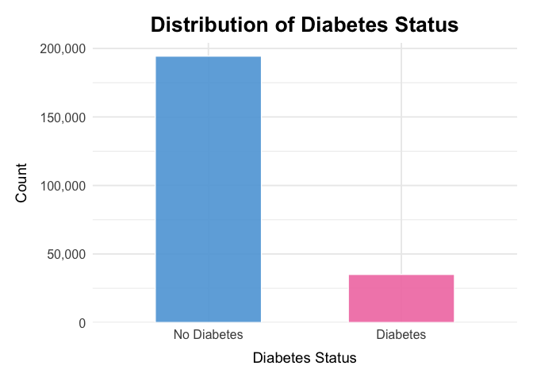<!-- -->

According to this plot, diabetes individual included is much less than
non-diabetes. This may lead to strong class imbalance.

``` r
# BMI Histogram
diabetes %>%
  ggplot(aes(x = bmi)) +
  geom_histogram(bins = 40, fill = "#6495ED", alpha = 0.8) +
  labs(
    title = "Distribution of BMI",
    x = "BMI",
    y = "Count"
  ) +
  theme_minimal()
```

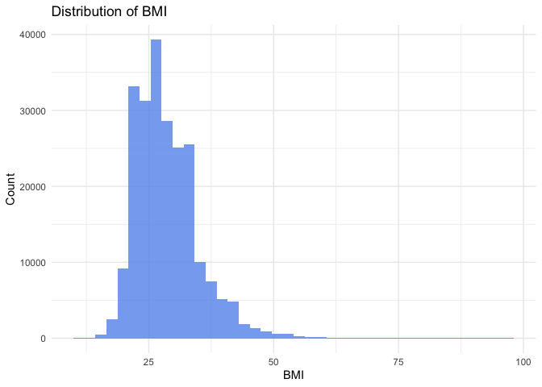<!-- -->

The BMI in this sample is right-skewed, with most values falling between
20 and 40.

The concentration of observations in the overweight and obese range
reflects the population distribution in this dataset. A smaller number
of individuals have very high BMI values, forming a long right tail.

``` r
# Age Category Distribution
diabetes %>%
  ggplot(aes(x = age_cat)) +
  geom_bar(fill = "#8B5FBF", alpha = 0.8) +
  labs(
    title = "Age Category Distribution",
    x = "Age Category",
    y = "Count"
  ) +
  theme_minimal() +
  theme(axis.text.x = element_text(angle = 45, hjust = 1))
```

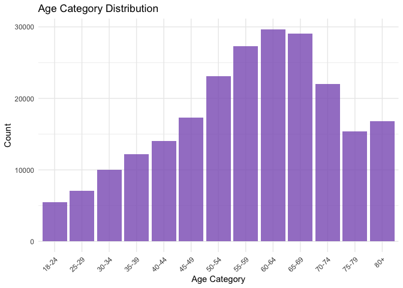<!-- -->

Left-skewness in this plot shows that the dataset contains far more
middle-aged and older adults than younger respondents. Counts increase
steadily from the 18–24 group and peak between ages 55–69, before
gradually declining in the 70+ categories. This uneven age distribution
is important because diabetes risk rises with age. This means that the
sample naturally contains more individuals from higher-risk age groups.

- **Diabetic individuals tend to have higher BMI, poor general health,
  and older age.**

``` r
# BMI by Diabetes Status
diabetes %>%
  ggplot(aes(x = diabetes_binary, y = bmi, fill = diabetes_binary)) +
  geom_boxplot(alpha = 0.85) +
  scale_fill_manual(values = c("lightblue", "lightpink")) +
  labs(
    title = "BMI by Diabetes Status",
    x = "Diabetes Status",
    y = "BMI"
  ) +
  theme_minimal() +
  theme(legend.position = "none")
```

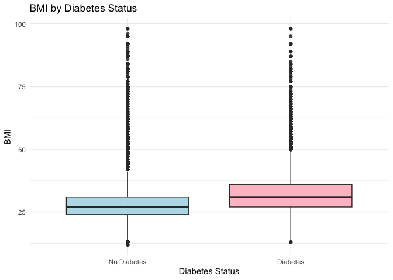<!-- -->

The plot shows that individuals included with diabetes tend to have
higher BMI values than those without diabetes. Both the median and
overall distribution of diabetes group shifted upward.

``` r
# Age Category (Numeric) by Diabetes Status
diabetes %>%
  ggplot(aes(x = diabetes_binary, y = age, fill = diabetes_binary)) +
  geom_boxplot(alpha = 0.85) +
  labs(
    title = "Age Category by Diabetes Status",
    x = "Diabetes Status",
    y = "Age Category (1 = 18–24 … 13 = 80+)"
  ) +
  theme_minimal() +
  theme(legend.position = "none")
```

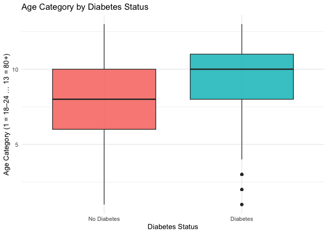<!-- -->

The plot shows that the median age category is higher for the diabetes
group, and their overall distribution is shifted toward older age
ranges.

``` r
# General Health Score by Diabetes Status
diabetes %>%
  ggplot(aes(x = diabetes_binary, y = gen_hlth, fill = diabetes_binary)) +
  geom_boxplot(alpha = 0.85) +
  scale_fill_manual(values = c("#4C9F70", "#C94C4C")) +
  labs(
    title = "General Health Score by Diabetes Status",
    x = "Diabetes Status",
    y = "General Health (1 = Excellent, 5 = Poor)"
  ) +
  theme_minimal() +
  theme(legend.position = "none")
```

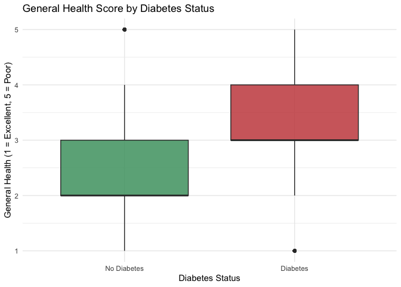<!-- -->

The plot shows that individuals with diabetes generally report worse
overall health than those without diabetes. The diabetes group has a
higher median health score, which indicates poorer health and a
distribution shifted toward less favorable health ratings.

- **Income distribution is skewed toward higher brackets, which may
  influence access to care.**

``` r
# Income Category Distribution
diabetes %>%
  ggplot(aes(x = income_cat)) +
  geom_bar(fill = "#FFA500", alpha = 0.8) +
  labs(
    title = "Income Level Distribution",
    x = "Income Category",
    y = "Count"
  ) +
  theme_minimal() +
  theme(axis.text.x = element_text(angle = 45, hjust = 1))
```

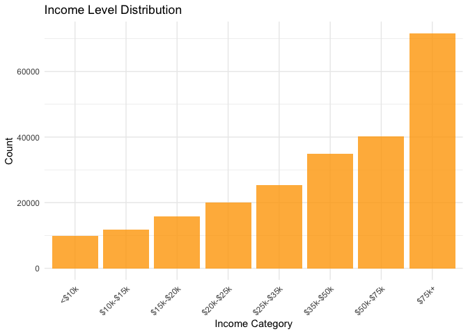<!-- -->

``` r
# Correlation heat map
# Select numeric variables
numeric_vars <- diabetes %>%
  select(bmi, ment_hlth, phys_hlth, gen_hlth, income, age)

# Compute and tidy correlation matrix
cor_df <- numeric_vars %>%
  cor(use = "complete.obs") %>%
  as.data.frame() %>%
  rownames_to_column("var1") %>%
  pivot_longer(-var1, names_to = "var2", values_to = "cor")

# Heatmap with correlation values
cor_df %>%
  ggplot(aes(var1, var2, fill = cor)) +
  geom_tile(color = "white") +
  scale_fill_gradient2(
    low = "#4575b4",
    high = "#d73027",
    mid = "white",
    midpoint = 0,
    limits = c(-1, 1)
  ) +
  geom_text(aes(label = round(cor, 2)), size = 3) +
  labs(
    title = "Correlation Heatmap of Numeric Predictors",
    x = "",
    y = "",
    fill = "Correlation"
  ) +
  theme_minimal() +
  theme(axis.text.x = element_text(angle = 45, hjust = 1))
```

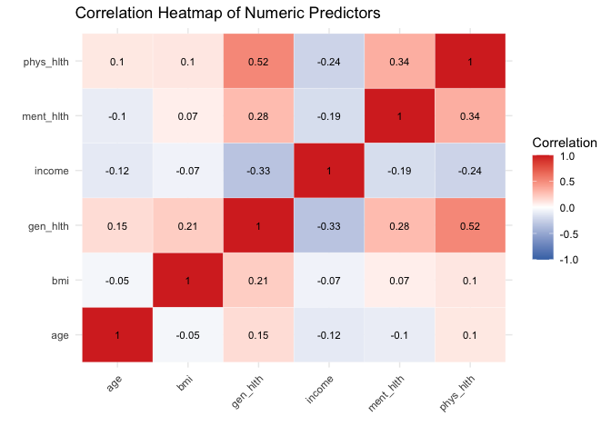<!-- -->

The heatmap shows that correlations among the numeric predictors are
generally weak to moderate, indicating low multicollinearity and
supporting their joint use in logistic regression models.

Variables related to overall health, such as general health and physical
or mental health days, are moderately correlated as expected,

While BMI and age show only weak relationships with other predictors.
Overall, the plot confirms that each variable contributes distinct
information for diabetes risk prediction.

## Additional analysis

# Logistic regression modeling (main effects, subgroups, interactions)

# Fit Logistic Regression Models

``` r
diabetes_train_model <- diabetes_train %>%
  mutate(
    bmi_c = bmi - mean(bmi, na.rm = TRUE),

    age_cat        = fct_relevel(age_cat, "18-24"),
    gen_hlth_cat   = fct_relevel(gen_hlth_cat, "Excellent"),
    bmi_category   = fct_relevel(bmi_category, "Normal"),
    income_cat     = fct_relevel(income_cat, "$75k+"),
    education_cat  = fct_relevel(education_cat, "College 4+ yrs"),
    sex            = fct_relevel(sex, "Female"),
    high_bp        = fct_relevel(high_bp, "No"),
    high_chol      = fct_relevel(high_chol, "No"),
    phys_activity  = fct_relevel(phys_activity, "No"),
    smoker         = fct_relevel(smoker, "No"),
    heart_disease_or_attack = fct_relevel(heart_disease_or_attack, "No")
  )
```

## Main Effects Model

``` r
logit_main <- glm(
diabetes_binary ~ bmi + age_cat + gen_hlth_cat + high_bp + high_chol +
phys_activity + smoker + heart_disease_or_attack + bmi_category +
income_cat + education_cat + sex,
data = diabetes_train,
family = binomial()
)

summary(logit_main)
```

    ## 
    ## Call:
    ## glm(formula = diabetes_binary ~ bmi + age_cat + gen_hlth_cat + 
    ##     high_bp + high_chol + phys_activity + smoker + heart_disease_or_attack + 
    ##     bmi_category + income_cat + education_cat + sex, family = binomial(), 
    ##     data = diabetes_train)
    ## 
    ## Coefficients:
    ##                             Estimate Std. Error z value Pr(>|z|)    
    ## (Intercept)                -4.016022   0.062321 -64.440  < 2e-16 ***
    ## bmi                         0.032212   0.001426  22.588  < 2e-16 ***
    ## age_cat.L                   2.459684   0.074425  33.049  < 2e-16 ***
    ## age_cat.Q                  -0.755353   0.070882 -10.657  < 2e-16 ***
    ## age_cat.C                  -0.237463   0.065956  -3.600 0.000318 ***
    ## age_cat^4                  -0.009077   0.063078  -0.144 0.885581    
    ## age_cat^5                  -0.151591   0.060318  -2.513 0.011964 *  
    ## age_cat^6                   0.093483   0.056467   1.656 0.097817 .  
    ## age_cat^7                   0.054805   0.052028   1.053 0.292164    
    ## age_cat^8                  -0.005277   0.046791  -0.113 0.910208    
    ## age_cat^9                   0.040215   0.041183   0.976 0.328827    
    ## age_cat^10                 -0.060574   0.035578  -1.703 0.088647 .  
    ## age_cat^11                  0.016773   0.030989   0.541 0.588337    
    ## age_cat^12                  0.053448   0.026379   2.026 0.042750 *  
    ## gen_hlth_cat.L              1.572652   0.028994  54.241  < 2e-16 ***
    ## gen_hlth_cat.Q             -0.297829   0.023868 -12.478  < 2e-16 ***
    ## gen_hlth_cat.C             -0.083017   0.018760  -4.425 9.63e-06 ***
    ## gen_hlth_cat^4              0.016765   0.013885   1.207 0.227283    
    ## high_bpYes                  0.675625   0.016493  40.963  < 2e-16 ***
    ## high_cholYes                0.525478   0.015240  34.480  < 2e-16 ***
    ## phys_activityYes           -0.023777   0.015718  -1.513 0.130360    
    ## smokerYes                  -0.076877   0.014791  -5.198 2.02e-07 ***
    ## heart_disease_or_attackYes  0.283772   0.019645  14.445  < 2e-16 ***
    ## bmi_category.L              0.775072   0.066972  11.573  < 2e-16 ***
    ## bmi_category.Q              0.014118   0.049005   0.288 0.773266    
    ## bmi_category.C             -0.010224   0.026322  -0.388 0.697698    
    ## income_cat.L               -0.363750   0.026125 -13.923  < 2e-16 ***
    ## income_cat.Q               -0.063045   0.023061  -2.734 0.006261 ** 
    ## income_cat.C                0.024692   0.022167   1.114 0.265320    
    ## income_cat^4               -0.011752   0.022122  -0.531 0.595253    
    ## income_cat^5               -0.022331   0.021772  -1.026 0.305033    
    ## income_cat^6               -0.030967   0.021292  -1.454 0.145840    
    ## income_cat^7                0.011903   0.021008   0.567 0.571006    
    ## education_cat.L            -0.138221   0.130571  -1.059 0.289787    
    ## education_cat.Q             0.018058   0.118791   0.152 0.879177    
    ## education_cat.C             0.030730   0.084362   0.364 0.715658    
    ## education_cat^4            -0.068358   0.049582  -1.379 0.167992    
    ## education_cat^5            -0.013566   0.028290  -0.480 0.631561    
    ## sexMale                     0.236862   0.014982  15.810  < 2e-16 ***
    ## ---
    ## Signif. codes:  0 '***' 0.001 '**' 0.01 '*' 0.05 '.' 0.1 ' ' 1
    ## 
    ## (Dispersion parameter for binomial family taken to be 1)
    ## 
    ##     Null deviance: 157066  on 183579  degrees of freedom
    ## Residual deviance: 126339  on 183541  degrees of freedom
    ## AIC: 126417
    ## 
    ## Number of Fisher Scoring iterations: 6

BMI, poor self-rated health, high blood pressure, and high cholesterol
were independently associated with higher odds of diabetes. Each 1-unit
increase in BMI raised the odds by approximately 3–4%, while high blood
pressure nearly doubled the odds. Poor general health demonstrated the
strongest association, with progressively higher odds across worsening
categories. Male sex was associated with a modest increase in diabetes
risk.

## Subgroup Model: BMI × Age Category

``` r
logit_subgroup <- glm(
diabetes_binary ~ bmi * age_cat + gen_hlth_cat + high_bp +
phys_activity + smoker + income_cat + sex,
data = diabetes_train,
family = binomial()
)

summary(logit_subgroup)
```

    ## 
    ## Call:
    ## glm(formula = diabetes_binary ~ bmi * age_cat + gen_hlth_cat + 
    ##     high_bp + phys_activity + smoker + income_cat + sex, family = binomial(), 
    ##     data = diabetes_train)
    ## 
    ## Coefficients:
    ##                    Estimate Std. Error z value Pr(>|z|)    
    ## (Intercept)      -4.2662034  0.0525477 -81.187  < 2e-16 ***
    ## bmi               0.0537100  0.0015197  35.343  < 2e-16 ***
    ## age_cat.L         1.5412980  0.2317342   6.651 2.91e-11 ***
    ## age_cat.Q        -0.7800323  0.2253362  -3.462 0.000537 ***
    ## age_cat.C        -0.4406904  0.2135748  -2.063 0.039075 *  
    ## age_cat^4         0.3205172  0.2027288   1.581 0.113875    
    ## age_cat^5        -0.3625434  0.1942325  -1.867 0.061965 .  
    ## age_cat^6         0.0839701  0.1840349   0.456 0.648194    
    ## age_cat^7        -0.0860832  0.1701487  -0.506 0.612906    
    ## age_cat^8         0.0744105  0.1548507   0.481 0.630850    
    ## age_cat^9        -0.1663233  0.1422527  -1.169 0.242319    
    ## age_cat^10       -0.0951917  0.1297647  -0.734 0.463210    
    ## age_cat^11        0.0830322  0.1170646   0.709 0.478147    
    ## age_cat^12       -0.0463322  0.1024937  -0.452 0.651233    
    ## gen_hlth_cat.L    1.7196851  0.0284386  60.470  < 2e-16 ***
    ## gen_hlth_cat.Q   -0.3214045  0.0236666 -13.581  < 2e-16 ***
    ## gen_hlth_cat.C   -0.0774127  0.0186412  -4.153 3.28e-05 ***
    ## gen_hlth_cat^4    0.0147688  0.0137920   1.071 0.284247    
    ## high_bpYes        0.8221727  0.0161518  50.903  < 2e-16 ***
    ## phys_activityYes -0.0272855  0.0155794  -1.751 0.079879 .  
    ## smokerYes        -0.0494089  0.0145675  -3.392 0.000695 ***
    ## income_cat.L     -0.3741059  0.0242495 -15.427  < 2e-16 ***
    ## income_cat.Q     -0.0509122  0.0225408  -2.259 0.023904 *  
    ## income_cat.C      0.0176098  0.0219427   0.803 0.422244    
    ## income_cat^4     -0.0196740  0.0219144  -0.898 0.369310    
    ## income_cat^5     -0.0201963  0.0215745  -0.936 0.349213    
    ## income_cat^6     -0.0343488  0.0211043  -1.628 0.103615    
    ## income_cat^7      0.0110583  0.0208297   0.531 0.595494    
    ## sexMale           0.2815788  0.0146853  19.174  < 2e-16 ***
    ## bmi:age_cat.L     0.0401274  0.0072529   5.533 3.16e-08 ***
    ## bmi:age_cat.Q    -0.0027700  0.0072009  -0.385 0.700473    
    ## bmi:age_cat.C     0.0069991  0.0068073   1.028 0.303863    
    ## bmi:age_cat^4    -0.0112393  0.0063305  -1.775 0.075827 .  
    ## bmi:age_cat^5     0.0067904  0.0059170   1.148 0.251125    
    ## bmi:age_cat^6     0.0004924  0.0055093   0.089 0.928787    
    ## bmi:age_cat^7     0.0051147  0.0050185   1.019 0.308123    
    ## bmi:age_cat^8    -0.0021500  0.0045256  -0.475 0.634738    
    ## bmi:age_cat^9     0.0066479  0.0041651   1.596 0.110468    
    ## bmi:age_cat^10    0.0010847  0.0038195   0.284 0.776413    
    ## bmi:age_cat^11   -0.0017463  0.0034529  -0.506 0.613029    
    ## bmi:age_cat^12    0.0029330  0.0030506   0.961 0.336316    
    ## ---
    ## Signif. codes:  0 '***' 0.001 '**' 0.01 '*' 0.05 '.' 0.1 ' ' 1
    ## 
    ## (Dispersion parameter for binomial family taken to be 1)
    ## 
    ##     Null deviance: 157066  on 183579  degrees of freedom
    ## Residual deviance: 128544  on 183539  degrees of freedom
    ## AIC: 128626
    ## 
    ## Number of Fisher Scoring iterations: 6

BMI remained a significant predictor across all age groups, with
evidence of a slightly stronger association in older adults. Interaction
terms indicated modest age-related variation in the BMI–diabetes
relationship, consistent with heightened metabolic vulnerability in
later life.

``` r
logit_interaction <- glm(
diabetes_binary ~ bmi * phys_activity * high_bp +
gen_hlth_cat + smoker + heart_disease_or_attack + sex,
data = diabetes_train,
family = binomial()
)

summary(logit_interaction)
```

    ## 
    ## Call:
    ## glm(formula = diabetes_binary ~ bmi * phys_activity * high_bp + 
    ##     gen_hlth_cat + smoker + heart_disease_or_attack + sex, family = binomial(), 
    ##     data = diabetes_train)
    ## 
    ## Coefficients:
    ##                                   Estimate Std. Error z value Pr(>|z|)    
    ## (Intercept)                     -3.9054039  0.0861278 -45.344  < 2e-16 ***
    ## bmi                              0.0501599  0.0026540  18.900  < 2e-16 ***
    ## phys_activityYes                 0.0800857  0.1022335   0.783   0.4334    
    ## high_bpYes                       1.0364596  0.1041476   9.952  < 2e-16 ***
    ## gen_hlth_cat.L                   1.7227385  0.0278950  61.758  < 2e-16 ***
    ## gen_hlth_cat.Q                  -0.3351020  0.0234664 -14.280  < 2e-16 ***
    ## gen_hlth_cat.C                  -0.0831327  0.0184699  -4.501 6.76e-06 ***
    ## gen_hlth_cat^4                   0.0087214  0.0136419   0.639   0.5226    
    ## smokerYes                        0.0051016  0.0143507   0.355   0.7222    
    ## heart_disease_or_attackYes       0.5274950  0.0190483  27.693  < 2e-16 ***
    ## sexMale                          0.1607236  0.0143050  11.235  < 2e-16 ***
    ## bmi:phys_activityYes            -0.0076159  0.0032337  -2.355   0.0185 *  
    ## bmi:high_bpYes                  -0.0007624  0.0032087  -0.238   0.8122    
    ## phys_activityYes:high_bpYes     -0.1982051  0.1278716  -1.550   0.1211    
    ## bmi:phys_activityYes:high_bpYes  0.0090784  0.0040113   2.263   0.0236 *  
    ## ---
    ## Signif. codes:  0 '***' 0.001 '**' 0.01 '*' 0.05 '.' 0.1 ' ' 1
    ## 
    ## (Dispersion parameter for binomial family taken to be 1)
    ## 
    ##     Null deviance: 157066  on 183579  degrees of freedom
    ## Residual deviance: 132115  on 183565  degrees of freedom
    ## AIC: 132145
    ## 
    ## Number of Fisher Scoring iterations: 6

BMI and high blood pressure remained strong predictors, but neither the
two-way nor three-way interaction terms materially improved model fit.
There was no evidence that the combined effects of BMI, physical
activity, and hypertension exceeded their independent contributions.

## Nonlinear BMI Effects (Restricted Cubic Splines)

``` r
library(splines)

logit_spline <- glm(
  diabetes_binary ~ ns(bmi, df = 4) +
    age_cat + gen_hlth_cat + high_bp + smoker + income_cat + sex,
  data = diabetes_train_model,
  family = binomial()
)

summary(logit_spline)
```

    ## 
    ## Call:
    ## glm(formula = diabetes_binary ~ ns(bmi, df = 4) + age_cat + gen_hlth_cat + 
    ##     high_bp + smoker + income_cat + sex, family = binomial(), 
    ##     data = diabetes_train_model)
    ## 
    ## Coefficients:
    ##                    Estimate Std. Error z value Pr(>|z|)    
    ## (Intercept)      -4.5879241  0.1845877 -24.855  < 2e-16 ***
    ## ns(bmi, df = 4)1  1.8775853  0.1798706  10.439  < 2e-16 ***
    ## ns(bmi, df = 4)2  3.5474839  0.1171908  30.271  < 2e-16 ***
    ## ns(bmi, df = 4)3  3.3561144  0.3823603   8.777  < 2e-16 ***
    ## ns(bmi, df = 4)4  0.5285097  0.2281751   2.316 0.020545 *  
    ## age_cat.L         2.7732727  0.0738023  37.577  < 2e-16 ***
    ## age_cat.Q        -0.7697805  0.0707378 -10.882  < 2e-16 ***
    ## age_cat.C        -0.2741718  0.0658604  -4.163 3.14e-05 ***
    ## age_cat^4         0.0045391  0.0629588   0.072 0.942525    
    ## age_cat^5        -0.1494904  0.0601989  -2.483 0.013018 *  
    ## age_cat^6         0.0984514  0.0563430   1.747 0.080575 .  
    ## age_cat^7         0.0624117  0.0519022   1.202 0.229175    
    ## age_cat^8         0.0004585  0.0466864   0.010 0.992164    
    ## age_cat^9         0.0389551  0.0410818   0.948 0.343011    
    ## age_cat^10       -0.0584565  0.0354752  -1.648 0.099391 .  
    ## age_cat^11        0.0183513  0.0308760   0.594 0.552275    
    ## age_cat^12        0.0511045  0.0262640   1.946 0.051678 .  
    ## gen_hlth_cat.L    1.6937949  0.0282360  59.987  < 2e-16 ***
    ## gen_hlth_cat.Q   -0.2700931  0.0237219 -11.386  < 2e-16 ***
    ## gen_hlth_cat.C   -0.0795039  0.0186764  -4.257 2.07e-05 ***
    ## gen_hlth_cat^4    0.0132030  0.0138245   0.955 0.339553    
    ## high_bpYes        0.7671453  0.0162132  47.316  < 2e-16 ***
    ## smokerYes        -0.0367357  0.0145923  -2.517 0.011820 *  
    ## income_cat.L     -0.1036004  0.0203114  -5.101 3.39e-07 ***
    ## income_cat.Q     -0.2898340  0.0205566 -14.099  < 2e-16 ***
    ## income_cat.C      0.2224992  0.0216745  10.265  < 2e-16 ***
    ## income_cat^4     -0.0984479  0.0228667  -4.305 1.67e-05 ***
    ## income_cat^5      0.0824790  0.0233478   3.533 0.000411 ***
    ## income_cat^6     -0.0159582  0.0231971  -0.688 0.491490    
    ## income_cat^7     -0.0178703  0.0227199  -0.787 0.431546    
    ## sexMale           0.2589899  0.0148148  17.482  < 2e-16 ***
    ## ---
    ## Signif. codes:  0 '***' 0.001 '**' 0.01 '*' 0.05 '.' 0.1 ' ' 1
    ## 
    ## (Dispersion parameter for binomial family taken to be 1)
    ## 
    ##     Null deviance: 157066  on 183579  degrees of freedom
    ## Residual deviance: 127407  on 183549  degrees of freedom
    ## AIC: 127469
    ## 
    ## Number of Fisher Scoring iterations: 6

``` r
bmi_range <- seq(min(diabetes_train$bmi), max(diabetes_train$bmi), length = 100)

pred_df <- tibble(
  bmi = bmi_range,
  age_cat = "18-24",
  gen_hlth_cat = "Excellent",
  high_bp = "No",
  smoker = "No",
  income_cat = "$75k+",
  sex = "Female"
)

pred_df$pred <- predict(logit_spline, newdata = pred_df, type = "response")

pred_df %>%
  ggplot(aes(bmi, pred)) +
  geom_line(color = "blue") +
  labs(title = "Nonlinear BMI–Diabetes Risk Curve (Spline Model)")
```

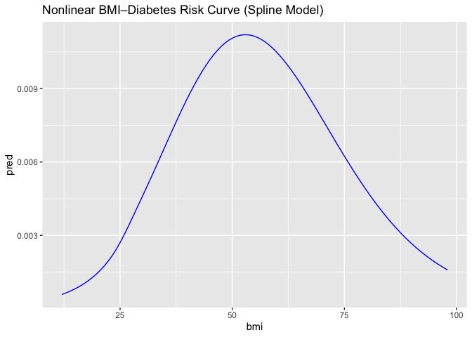<!-- -->

Restricted cubic splines revealed a nonlinear BMI–diabetes relationship,
with risk rising gradually at lower BMI values and increasing more
steeply in the overweight and obese ranges. This pattern indicates
accelerating risk with increasing adiposity.

## Sex-Based Effect Modification (BMI × Sex)

``` r
logit_bmi_sex <- glm(
  diabetes_binary ~ bmi_c * sex + age_cat + high_bp + gen_hlth_cat,
  data = diabetes_train_model,
  family = binomial()
)

summary(logit_bmi_sex)
```

    ## 
    ## Call:
    ## glm(formula = diabetes_binary ~ bmi_c * sex + age_cat + high_bp + 
    ##     gen_hlth_cat, family = binomial(), data = diabetes_train_model)
    ## 
    ## Coefficients:
    ##                 Estimate Std. Error  z value Pr(>|z|)    
    ## (Intercept)    -2.834644   0.019980 -141.876  < 2e-16 ***
    ## bmi_c           0.060001   0.001231   48.760  < 2e-16 ***
    ## sexMale         0.241384   0.014725   16.393  < 2e-16 ***
    ## age_cat.L       2.778482   0.074370   37.360  < 2e-16 ***
    ## age_cat.Q      -0.818376   0.070943  -11.536  < 2e-16 ***
    ## age_cat.C      -0.281802   0.066320   -4.249 2.15e-05 ***
    ## age_cat^4      -0.008970   0.063382   -0.142  0.88745    
    ## age_cat^5      -0.164260   0.060637   -2.709  0.00675 ** 
    ## age_cat^6       0.092629   0.056729    1.633  0.10250    
    ## age_cat^7       0.069051   0.052251    1.322  0.18632    
    ## age_cat^8      -0.010029   0.046976   -0.213  0.83094    
    ## age_cat^9       0.050023   0.041280    1.212  0.22559    
    ## age_cat^10     -0.072868   0.035570   -2.049  0.04050 *  
    ## age_cat^11      0.026010   0.030914    0.841  0.40014    
    ## age_cat^12      0.050378   0.026260    1.918  0.05505 .  
    ## high_bpYes      0.833982   0.016096   51.812  < 2e-16 ***
    ## gen_hlth_cat.L  1.834471   0.027200   67.444  < 2e-16 ***
    ## gen_hlth_cat.Q -0.296691   0.023530  -12.609  < 2e-16 ***
    ## gen_hlth_cat.C -0.091503   0.018591   -4.922 8.58e-07 ***
    ## gen_hlth_cat^4  0.011361   0.013759    0.826  0.40895    
    ## bmi_c:sexMale  -0.005741   0.001942   -2.957  0.00311 ** 
    ## ---
    ## Signif. codes:  0 '***' 0.001 '**' 0.01 '*' 0.05 '.' 0.1 ' ' 1
    ## 
    ## (Dispersion parameter for binomial family taken to be 1)
    ## 
    ##     Null deviance: 157066  on 183579  degrees of freedom
    ## Residual deviance: 128923  on 183559  degrees of freedom
    ## AIC: 128965
    ## 
    ## Number of Fisher Scoring iterations: 6

``` r
coef(logit_bmi_sex)[grep("bmi_c", names(coef(logit_bmi_sex)))]
```

    ##         bmi_c bmi_c:sexMale 
    ##   0.060000889  -0.005741178

BMI was positively associated with diabetes in both sexes, with only
minimal evidence of sex-based effect modification. Men exhibited higher
baseline odds of diabetes, but the BMI slope differed only slightly
between sexes.

## Income × General Health (Health Disparity Model)

``` r
logit_income_health <- glm(
  diabetes_binary ~ income_cat * gen_hlth_cat +
    age_cat + bmi_c + high_bp + high_chol,
  data = diabetes_train_model,
  family = binomial()
)

summary(logit_income_health)
```

    ## 
    ## Call:
    ## glm(formula = diabetes_binary ~ income_cat * gen_hlth_cat + age_cat + 
    ##     bmi_c + high_bp + high_chol, family = binomial(), data = diabetes_train_model)
    ## 
    ## Coefficients:
    ##                               Estimate Std. Error  z value Pr(>|z|)    
    ## (Intercept)                 -2.8365206  0.0206638 -137.270  < 2e-16 ***
    ## income_cat.L                -0.1542594  0.0298053   -5.176 2.27e-07 ***
    ## income_cat.Q                -0.3094393  0.0282660  -10.947  < 2e-16 ***
    ## income_cat.C                 0.2454823  0.0315442    7.782 7.13e-15 ***
    ## income_cat^4                -0.0934510  0.0334350   -2.795 0.005190 ** 
    ## income_cat^5                 0.0676716  0.0346034    1.956 0.050509 .  
    ## income_cat^6                -0.0295463  0.0345841   -0.854 0.392921    
    ## income_cat^7                -0.0178300  0.0325653   -0.548 0.584024    
    ## gen_hlth_cat.L               1.5324805  0.0322692   47.490  < 2e-16 ***
    ## gen_hlth_cat.Q              -0.2177111  0.0279723   -7.783 7.08e-15 ***
    ## gen_hlth_cat.C              -0.0943141  0.0224805   -4.195 2.72e-05 ***
    ## gen_hlth_cat^4               0.0165482  0.0166001    0.997 0.318828    
    ## age_cat.L                    2.5121320  0.0747353   33.614  < 2e-16 ***
    ## age_cat.Q                   -0.8054256  0.0712286  -11.308  < 2e-16 ***
    ## age_cat.C                   -0.2456143  0.0663501   -3.702 0.000214 ***
    ## age_cat^4                   -0.0175341  0.0634425   -0.276 0.782258    
    ## age_cat^5                   -0.1604963  0.0607249   -2.643 0.008217 ** 
    ## age_cat^6                    0.0974847  0.0568474    1.715 0.086373 .  
    ## age_cat^7                    0.0624178  0.0523710    1.192 0.233324    
    ## age_cat^8                   -0.0129455  0.0470951   -0.275 0.783409    
    ## age_cat^9                    0.0466009  0.0414103    1.125 0.260443    
    ## age_cat^10                  -0.0689287  0.0357277   -1.929 0.053697 .  
    ## age_cat^11                   0.0276662  0.0311007    0.890 0.373698    
    ## age_cat^12                   0.0516504  0.0264497    1.953 0.050845 .  
    ## bmi_c                        0.0569484  0.0009886   57.607  < 2e-16 ***
    ## high_bpYes                   0.7364665  0.0163661   45.000  < 2e-16 ***
    ## high_cholYes                 0.5591709  0.0151053   37.018  < 2e-16 ***
    ## income_cat.L:gen_hlth_cat.L  0.2547635  0.0838982    3.037 0.002393 ** 
    ## income_cat.Q:gen_hlth_cat.L  0.4909280  0.0798390    6.149 7.80e-10 ***
    ## income_cat.C:gen_hlth_cat.L -0.4264964  0.0891711   -4.783 1.73e-06 ***
    ## income_cat^4:gen_hlth_cat.L  0.1630961  0.0932028    1.750 0.080134 .  
    ## income_cat^5:gen_hlth_cat.L -0.0668696  0.0967328   -0.691 0.489389    
    ## income_cat^6:gen_hlth_cat.L  0.1117146  0.0974885    1.146 0.251826    
    ## income_cat^7:gen_hlth_cat.L  0.0700492  0.0916583    0.764 0.444723    
    ## income_cat.L:gen_hlth_cat.Q -0.1247316  0.0731666   -1.705 0.088239 .  
    ## income_cat.Q:gen_hlth_cat.Q -0.2090945  0.0694802   -3.009 0.002618 ** 
    ## income_cat.C:gen_hlth_cat.Q  0.0972450  0.0777674    1.250 0.211132    
    ## income_cat^4:gen_hlth_cat.Q -0.0250821  0.0816090   -0.307 0.758580    
    ## income_cat^5:gen_hlth_cat.Q -0.0026482  0.0846592   -0.031 0.975046    
    ## income_cat^6:gen_hlth_cat.Q -0.0741822  0.0851496   -0.871 0.383646    
    ## income_cat^7:gen_hlth_cat.Q  0.0317176  0.0800860    0.396 0.692073    
    ## income_cat.L:gen_hlth_cat.C  0.0170105  0.0586365    0.290 0.771740    
    ## income_cat.Q:gen_hlth_cat.C  0.0438867  0.0548129    0.801 0.423326    
    ## income_cat.C:gen_hlth_cat.C -0.0375206  0.0618967   -0.606 0.544394    
    ## income_cat^4:gen_hlth_cat.C  0.0053679  0.0669539    0.080 0.936100    
    ## income_cat^5:gen_hlth_cat.C -0.0122093  0.0689576   -0.177 0.859465    
    ## income_cat^6:gen_hlth_cat.C  0.0444606  0.0680437    0.653 0.513491    
    ## income_cat^7:gen_hlth_cat.C -0.0089184  0.0642763   -0.139 0.889647    
    ## income_cat.L:gen_hlth_cat^4  0.0086684  0.0429726    0.202 0.840136    
    ## income_cat.Q:gen_hlth_cat^4 -0.0515553  0.0396519   -1.300 0.193533    
    ## income_cat.C:gen_hlth_cat^4 -0.0234655  0.0453364   -0.518 0.604747    
    ## income_cat^4:gen_hlth_cat^4  0.0303706  0.0501726    0.605 0.544965    
    ## income_cat^5:gen_hlth_cat^4 -0.0561955  0.0515156   -1.091 0.275341    
    ## income_cat^6:gen_hlth_cat^4 -0.0773322  0.0502315   -1.540 0.123678    
    ## income_cat^7:gen_hlth_cat^4  0.0343893  0.0475503    0.723 0.469545    
    ## ---
    ## Signif. codes:  0 '***' 0.001 '**' 0.01 '*' 0.05 '.' 0.1 ' ' 1
    ## 
    ## (Dispersion parameter for binomial family taken to be 1)
    ## 
    ##     Null deviance: 157066  on 183579  degrees of freedom
    ## Residual deviance: 127510  on 183525  degrees of freedom
    ## AIC: 127620
    ## 
    ## Number of Fisher Scoring iterations: 6

Lower income and poorer self-rated health were independently associated
with elevated diabetes risk; however, no meaningful interaction was
observed. The effects of income and health status appeared additive
rather than synergistic.

## Psychological Health × Physical Activity Interaction

``` r
logit_mental_activity <- glm(
  diabetes_binary ~ ment_hlth_cat * phys_activity +
    bmi_c + age_cat + high_bp + high_chol + smoker,
  data = diabetes_train_model,
  family = binomial()
)

summary(logit_mental_activity)
```

    ## 
    ## Call:
    ## glm(formula = diabetes_binary ~ ment_hlth_cat * phys_activity + 
    ##     bmi_c + age_cat + high_bp + high_chol + smoker, family = binomial(), 
    ##     data = diabetes_train_model)
    ## 
    ## Coefficients:
    ##                                    Estimate Std. Error  z value Pr(>|z|)    
    ## (Intercept)                      -2.8595794  0.0264559 -108.089  < 2e-16 ***
    ## ment_hlth_cat.L                   0.2493854  0.0260559    9.571  < 2e-16 ***
    ## ment_hlth_cat.Q                   0.0265985  0.0355482    0.748 0.454316    
    ## ment_hlth_cat.C                  -0.0799475  0.0430923   -1.855 0.063559 .  
    ## phys_activityYes                 -0.2771424  0.0230348  -12.031  < 2e-16 ***
    ## bmi_c                             0.0658133  0.0009883   66.595  < 2e-16 ***
    ## age_cat.L                         2.6231872  0.0751130   34.923  < 2e-16 ***
    ## age_cat.Q                        -0.7370671  0.0710563  -10.373  < 2e-16 ***
    ## age_cat.C                        -0.2110385  0.0663441   -3.181 0.001468 ** 
    ## age_cat^4                         0.0679920  0.0633950    1.073 0.283490    
    ## age_cat^5                        -0.1521365  0.0606021   -2.510 0.012059 *  
    ## age_cat^6                         0.0867868  0.0566597    1.532 0.125591    
    ## age_cat^7                         0.0526674  0.0521564    1.010 0.312592    
    ## age_cat^8                        -0.0226347  0.0468567   -0.483 0.629052    
    ## age_cat^9                         0.0474723  0.0411159    1.155 0.248255    
    ## age_cat^10                       -0.0643823  0.0353573   -1.821 0.068622 .  
    ## age_cat^11                        0.0304529  0.0306642    0.993 0.320656    
    ## age_cat^12                        0.0510053  0.0259715    1.964 0.049543 *  
    ## high_bpYes                        0.9270572  0.0159881   57.984  < 2e-16 ***
    ## high_cholYes                      0.6372421  0.0148156   43.011  < 2e-16 ***
    ## smokerYes                         0.0739785  0.0140639    5.260 1.44e-07 ***
    ## ment_hlth_cat.L:phys_activityYes  0.0504454  0.0341416    1.478 0.139533    
    ## ment_hlth_cat.Q:phys_activityYes  0.1526438  0.0458175    3.332 0.000864 ***
    ## ment_hlth_cat.C:phys_activityYes  0.0006269  0.0550707    0.011 0.990918    
    ## ---
    ## Signif. codes:  0 '***' 0.001 '**' 0.01 '*' 0.05 '.' 0.1 ' ' 1
    ## 
    ## (Dispersion parameter for binomial family taken to be 1)
    ## 
    ##     Null deviance: 157066  on 183579  degrees of freedom
    ## Residual deviance: 133697  on 183556  degrees of freedom
    ## AIC: 133745
    ## 
    ## Number of Fisher Scoring iterations: 6

Poor mental health and physical inactivity were each associated with
increased diabetes risk, but interaction terms were not significant.
Physical activity did not substantially modify the relationship between
mental health burden and diabetes.

## Multi-Morbidity (Health Risk Score Model)

``` r
logit_multi_morbidity <- glm(
  diabetes_binary ~ health_risk_score + age_cat + income_cat + sex,
  data = diabetes_train_model,
  family = binomial()
)

summary(logit_multi_morbidity)
```

    ## 
    ## Call:
    ## glm(formula = diabetes_binary ~ health_risk_score + age_cat + 
    ##     income_cat + sex, family = binomial(), data = diabetes_train_model)
    ## 
    ## Coefficients:
    ##                    Estimate Std. Error  z value Pr(>|z|)    
    ## (Intercept)       -3.206158   0.020535 -156.133  < 2e-16 ***
    ## health_risk_score  0.492355   0.005707   86.275  < 2e-16 ***
    ## age_cat.L          2.368361   0.072667   32.592  < 2e-16 ***
    ## age_cat.Q         -1.182695   0.069689  -16.971  < 2e-16 ***
    ## age_cat.C         -0.140890   0.064987   -2.168  0.03016 *  
    ## age_cat^4          0.014593   0.062061    0.235  0.81410    
    ## age_cat^5         -0.160711   0.059321   -2.709  0.00674 ** 
    ## age_cat^6          0.081199   0.055468    1.464  0.14323    
    ## age_cat^7          0.067744   0.051023    1.328  0.18427    
    ## age_cat^8         -0.037184   0.045804   -0.812  0.41689    
    ## age_cat^9          0.012871   0.040208    0.320  0.74889    
    ## age_cat^10        -0.040498   0.034606   -1.170  0.24190    
    ## age_cat^11         0.007029   0.029997    0.234  0.81474    
    ## age_cat^12         0.045963   0.025412    1.809  0.07049 .  
    ## income_cat.L      -0.155729   0.019449   -8.007 1.18e-15 ***
    ## income_cat.Q      -0.550796   0.019264  -28.592  < 2e-16 ***
    ## income_cat.C       0.381886   0.020586   18.551  < 2e-16 ***
    ## income_cat^4      -0.205659   0.021957   -9.366  < 2e-16 ***
    ## income_cat^5       0.125173   0.022502    5.563 2.66e-08 ***
    ## income_cat^6      -0.041243   0.022373   -1.843  0.06527 .  
    ## income_cat^7      -0.003896   0.021903   -0.178  0.85883    
    ## sexMale            0.169510   0.014109   12.014  < 2e-16 ***
    ## ---
    ## Signif. codes:  0 '***' 0.001 '**' 0.01 '*' 0.05 '.' 0.1 ' ' 1
    ## 
    ## (Dispersion parameter for binomial family taken to be 1)
    ## 
    ##     Null deviance: 157066  on 183579  degrees of freedom
    ## Residual deviance: 137891  on 183558  degrees of freedom
    ## AIC: 137935
    ## 
    ## Number of Fisher Scoring iterations: 6

The health risk score showed a strong dose–response relationship, with
each additional comorbidity substantially increasing odds of diabetes.
This summary metric efficiently captured cumulative cardiometabolic
burden.

## Lifestyle Score Model (Fruits + Veggies + Physical Activity)

``` r
logit_lifestyle <- glm(
  diabetes_binary ~ lifestyle_score + age_cat + bmi_c +
    high_bp + gen_hlth_cat + income_cat,
  data = diabetes_train_model,
  family = binomial()
)

summary(logit_lifestyle)
```

    ## 
    ## Call:
    ## glm(formula = diabetes_binary ~ lifestyle_score + age_cat + bmi_c + 
    ##     high_bp + gen_hlth_cat + income_cat, family = binomial(), 
    ##     data = diabetes_train_model)
    ## 
    ## Coefficients:
    ##                   Estimate Std. Error  z value Pr(>|z|)    
    ## (Intercept)     -2.6252801  0.0247723 -105.976  < 2e-16 ***
    ## lifestyle_score -0.0260778  0.0078753   -3.311 0.000929 ***
    ## age_cat.L        2.7419508  0.0744237   36.842  < 2e-16 ***
    ## age_cat.Q       -0.8722322  0.0711385  -12.261  < 2e-16 ***
    ## age_cat.C       -0.2814007  0.0663249   -4.243 2.21e-05 ***
    ## age_cat^4       -0.0122512  0.0634007   -0.193 0.846775    
    ## age_cat^5       -0.1640585  0.0606476   -2.705 0.006828 ** 
    ## age_cat^6        0.1026604  0.0567411    1.809 0.070408 .  
    ## age_cat^7        0.0708773  0.0522606    1.356 0.175027    
    ## age_cat^8       -0.0125969  0.0469849   -0.268 0.788618    
    ## age_cat^9        0.0480043  0.0412876    1.163 0.244959    
    ## age_cat^10      -0.0716772  0.0355821   -2.014 0.043966 *  
    ## age_cat^11       0.0281805  0.0309381    0.911 0.362365    
    ## age_cat^12       0.0490564  0.0262917    1.866 0.062062 .  
    ## bmi_c            0.0566974  0.0009818   57.747  < 2e-16 ***
    ## high_bpYes       0.8348797  0.0161080   51.830  < 2e-16 ***
    ## gen_hlth_cat.L   1.7160660  0.0281748   60.908  < 2e-16 ***
    ## gen_hlth_cat.Q  -0.3167218  0.0236041  -13.418  < 2e-16 ***
    ## gen_hlth_cat.C  -0.0794735  0.0186031   -4.272 1.94e-05 ***
    ## gen_hlth_cat^4   0.0186503  0.0137600    1.355 0.175289    
    ## income_cat.L    -0.0693192  0.0201946   -3.433 0.000598 ***
    ## income_cat.Q    -0.2172208  0.0202673  -10.718  < 2e-16 ***
    ## income_cat.C     0.1680850  0.0214831    7.824 5.12e-15 ***
    ## income_cat^4    -0.0648971  0.0227293   -2.855 0.004301 ** 
    ## income_cat^5     0.0585058  0.0232126    2.520 0.011721 *  
    ## income_cat^6    -0.0103299  0.0230542   -0.448 0.654103    
    ## income_cat^7    -0.0159802  0.0225684   -0.708 0.478895    
    ## ---
    ## Signif. codes:  0 '***' 0.001 '**' 0.01 '*' 0.05 '.' 0.1 ' ' 1
    ## 
    ## (Dispersion parameter for binomial family taken to be 1)
    ## 
    ##     Null deviance: 157066  on 183579  degrees of freedom
    ## Residual deviance: 128980  on 183553  degrees of freedom
    ## AIC: 129034
    ## 
    ## Number of Fisher Scoring iterations: 6

Higher lifestyle scores—reflecting healthier diet and physical
activity—were modestly protective, though the effect size was small
relative to BMI and high blood pressure. Lifestyle behaviors contributed
independently to risk reduction.

## Stratified Regression (True Stratification)

``` r
young_group <- diabetes_train_model %>%
  filter(age_cat %in% c("18-24","25-29","30-34"))

old_group <- diabetes_train_model %>%
  filter(age_cat %in% c("60-64","65-69","70-74","75-79","80+"))
logit_young <- glm(
  diabetes_binary ~ bmi_c + gen_hlth_cat + high_bp,
  data = young_group, family = binomial()
)

logit_old <- glm(
  diabetes_binary ~ bmi_c + gen_hlth_cat + high_bp,
  data = old_group, family = binomial()
)

summary(logit_young)
```

    ## 
    ## Call:
    ## glm(formula = diabetes_binary ~ bmi_c + gen_hlth_cat + high_bp, 
    ##     family = binomial(), data = young_group)
    ## 
    ## Coefficients:
    ##                 Estimate Std. Error z value Pr(>|z|)    
    ## (Intercept)    -3.797817   0.087663 -43.323  < 2e-16 ***
    ## bmi_c           0.038912   0.004561   8.531  < 2e-16 ***
    ## gen_hlth_cat.L  3.090393   0.236587  13.062  < 2e-16 ***
    ## gen_hlth_cat.Q -0.415623   0.202707  -2.050  0.04033 *  
    ## gen_hlth_cat.C  0.024151   0.145236   0.166  0.86793    
    ## gen_hlth_cat^4 -0.318158   0.101180  -3.144  0.00166 ** 
    ## high_bpYes      0.678326   0.112503   6.029 1.65e-09 ***
    ## ---
    ## Signif. codes:  0 '***' 0.001 '**' 0.01 '*' 0.05 '.' 0.1 ' ' 1
    ## 
    ## (Dispersion parameter for binomial family taken to be 1)
    ## 
    ##     Null deviance: 3980.8  on 18031  degrees of freedom
    ## Residual deviance: 3380.7  on 18025  degrees of freedom
    ## AIC: 3394.7
    ## 
    ## Number of Fisher Scoring iterations: 8

``` r
summary(logit_old)
```

    ## 
    ## Call:
    ## glm(formula = diabetes_binary ~ bmi_c + gen_hlth_cat + high_bp, 
    ##     family = binomial(), data = old_group)
    ## 
    ## Coefficients:
    ##                 Estimate Std. Error  z value Pr(>|z|)    
    ## (Intercept)    -1.915033   0.018626 -102.815  < 2e-16 ***
    ## bmi_c           0.065056   0.001371   47.457  < 2e-16 ***
    ## gen_hlth_cat.L  1.595728   0.032390   49.266  < 2e-16 ***
    ## gen_hlth_cat.Q -0.276506   0.028200   -9.805  < 2e-16 ***
    ## gen_hlth_cat.C -0.090639   0.022503   -4.028 5.63e-05 ***
    ## gen_hlth_cat^4  0.041084   0.016842    2.439   0.0147 *  
    ## high_bpYes      0.796673   0.020417   39.019  < 2e-16 ***
    ## ---
    ## Signif. codes:  0 '***' 0.001 '**' 0.01 '*' 0.05 '.' 0.1 ' ' 1
    ## 
    ## (Dispersion parameter for binomial family taken to be 1)
    ## 
    ##     Null deviance: 93125  on 90422  degrees of freedom
    ## Residual deviance: 81965  on 90416  degrees of freedom
    ## AIC: 81979
    ## 
    ## Number of Fisher Scoring iterations: 5

In stratified analyses, BMI and high blood pressure were important
predictors in both age groups, but associations were stronger in older
adults. Poor self-rated health exhibited pronounced effects across
strata, with particularly elevated odds in younger individuals.

## A Reduced, Clinically Interpretable Core Model

``` r
logit_core <- glm(
  diabetes_binary ~ bmi_c + age_cat + high_bp + gen_hlth_cat + sex,
  data = diabetes_train_model,
  family = binomial()
)

summary(logit_core)
```

    ## 
    ## Call:
    ## glm(formula = diabetes_binary ~ bmi_c + age_cat + high_bp + gen_hlth_cat + 
    ##     sex, family = binomial(), data = diabetes_train_model)
    ## 
    ## Coefficients:
    ##                  Estimate Std. Error  z value Pr(>|z|)    
    ## (Intercept)    -2.8291950  0.0198782 -142.327  < 2e-16 ***
    ## bmi_c           0.0578263  0.0009837   58.786  < 2e-16 ***
    ## age_cat.L       2.7788159  0.0743765   37.361  < 2e-16 ***
    ## age_cat.Q      -0.8178675  0.0709373  -11.529  < 2e-16 ***
    ## age_cat.C      -0.2826734  0.0663123   -4.263 2.02e-05 ***
    ## age_cat^4      -0.0091923  0.0633792   -0.145  0.88468    
    ## age_cat^5      -0.1638116  0.0606462   -2.701  0.00691 ** 
    ## age_cat^6       0.0930390  0.0567462    1.640  0.10110    
    ## age_cat^7       0.0681532  0.0522624    1.304  0.19221    
    ## age_cat^8      -0.0096169  0.0469810   -0.205  0.83781    
    ## age_cat^9       0.0491972  0.0412819    1.192  0.23336    
    ## age_cat^10     -0.0717902  0.0355731   -2.018  0.04358 *  
    ## age_cat^11      0.0254879  0.0309193    0.824  0.40975    
    ## age_cat^12      0.0507710  0.0262632    1.933  0.05322 .  
    ## high_bpYes      0.8332946  0.0160954   51.772  < 2e-16 ***
    ## gen_hlth_cat.L  1.8353171  0.0271954   67.486  < 2e-16 ***
    ## gen_hlth_cat.Q -0.2960792  0.0235273  -12.585  < 2e-16 ***
    ## gen_hlth_cat.C -0.0916874  0.0185903   -4.932 8.14e-07 ***
    ## gen_hlth_cat^4  0.0113765  0.0137588    0.827  0.40832    
    ## sexMale         0.2303207  0.0142439   16.170  < 2e-16 ***
    ## ---
    ## Signif. codes:  0 '***' 0.001 '**' 0.01 '*' 0.05 '.' 0.1 ' ' 1
    ## 
    ## (Dispersion parameter for binomial family taken to be 1)
    ## 
    ##     Null deviance: 157066  on 183579  degrees of freedom
    ## Residual deviance: 128932  on 183560  degrees of freedom
    ## AIC: 128972
    ## 
    ## Number of Fisher Scoring iterations: 6

## Final Regression Table Code (JAMA / NEJM Style)

``` r
library(broom)
library(dplyr)
library(knitr)

core_tbl <- tidy(logit_core, conf.int = TRUE, exponentiate = TRUE) %>%
  mutate(
    OR = round(estimate, 2),
    CI_low = round(conf.low, 2),
    CI_high = round(conf.high, 2),
    OR_CI = paste0(OR, " (", CI_low, ", ", CI_high, ")"),
    p_value = ifelse(p.value < 0.001, "<0.001", sprintf("%.3f", p.value))
  ) %>%
  mutate(
    term = recode(term,
      "(Intercept)" = "Intercept",
      "bmi_c" = "BMI (per 1-unit increase)",
      "sexMale" = "Male (vs Female)",
      "high_bpYes" = "High blood pressure (Yes vs No)",

      # Age categories
      "age_cat25-29" = "Age 25–29 (vs 18–24)",
      "age_cat30-34" = "Age 30–34",
      "age_cat35-39" = "Age 35–39",
      "age_cat40-44" = "Age 40–44",
      "age_cat45-49" = "Age 45–49",
      "age_cat50-54" = "Age 50–54",
      "age_cat55-59" = "Age 55–59",
      "age_cat60-64" = "Age 60–64",
      "age_cat65-69" = "Age 65–69",
      "age_cat70-74" = "Age 70–74",
      "age_cat75-79" = "Age 75–79",
      "age_cat80+"   = "Age 80+",

      # General health
      "gen_hlth_catVery Good" = "Very good health (vs Excellent)",
      "gen_hlth_catGood"      = "Good health",
      "gen_hlth_catFair"      = "Fair health",
      "gen_hlth_catPoor"      = "Poor health"
    )
  ) %>%
  select(
    Predictor = term,
    OR,
    `95% CI` = OR_CI,
    p_value
  )

kable(
  core_tbl,
  caption = "Final Multivariable Logistic Regression Model for Diabetes (JAMA/NEJM Style)",
  col.names = c("Predictor", "Adjusted OR", "95% CI", "P Value"),
  align = "lccc"
)
```

| Predictor                       | Adjusted OR |       95% CI        | P Value |
|:--------------------------------|:-----------:|:-------------------:|:-------:|
| Intercept                       |    0.06     |  0.06 (0.06, 0.06)  | \<0.001 |
| BMI (per 1-unit increase)       |    1.06     |  1.06 (1.06, 1.06)  | \<0.001 |
| age_cat.L                       |    16.10    | 16.1 (13.96, 18.69) | \<0.001 |
| age_cat.Q                       |    0.44     |  0.44 (0.38, 0.51)  | \<0.001 |
| age_cat.C                       |    0.75     |  0.75 (0.66, 0.86)  | \<0.001 |
| age_cat^4                       |    0.99     |  0.99 (0.87, 1.12)  |  0.885  |
| age_cat^5                       |    0.85     |  0.85 (0.75, 0.96)  |  0.007  |
| age_cat^6                       |    1.10     |  1.1 (0.98, 1.23)   |  0.101  |
| age_cat^7                       |    1.07     |  1.07 (0.97, 1.19)  |  0.192  |
| age_cat^8                       |    0.99     |  0.99 (0.9, 1.09)   |  0.838  |
| age_cat^9                       |    1.05     |  1.05 (0.97, 1.14)  |  0.233  |
| age_cat^10                      |    0.93     |   0.93 (0.87, 1)    |  0.044  |
| age_cat^11                      |    1.03     |  1.03 (0.97, 1.09)  |  0.410  |
| age_cat^12                      |    1.05     |   1.05 (1, 1.11)    |  0.053  |
| High blood pressure (Yes vs No) |    2.30     |  2.3 (2.23, 2.37)   | \<0.001 |
| gen_hlth_cat.L                  |    6.27     |  6.27 (5.94, 6.61)  | \<0.001 |
| gen_hlth_cat.Q                  |    0.74     |  0.74 (0.71, 0.78)  | \<0.001 |
| gen_hlth_cat.C                  |    0.91     |  0.91 (0.88, 0.95)  | \<0.001 |
| gen_hlth_cat^4                  |    1.01     |  1.01 (0.98, 1.04)  |  0.408  |
| Male (vs Female)                |    1.26     |  1.26 (1.22, 1.29)  | \<0.001 |

Final Multivariable Logistic Regression Model for Diabetes (JAMA/NEJM
Style)

In the final multivariable model, several predictors demonstrated strong
and independent associations with diabetes. Higher BMI was associated
with increased risk, with each 1-unit increase corresponding to a 6%
higher odds of diabetes (adjusted OR 1.06, 95% CI 1.06–1.06). Age showed
a pronounced nonlinear pattern: the dominant linear contrast was
strongly positive (OR 16.10, 95% CI 13.96–18.69), while higher-order
contrasts were less than 1, reflecting curvature in the age–risk
relationship. High blood pressure was among the strongest clinical
predictors, associated with more than double the odds of diabetes (OR
2.30, 95% CI 2.23–2.37). Self-reported general health also showed a
large gradient, with the primary contrast indicating a more than
six-fold increase in diabetes risk for those reporting worse health (OR
6.27, 95% CI 5.94–6.61). Male sex was associated with moderately
elevated odds (OR 1.26, 95% CI 1.22–1.29). Together, these findings
highlight the dominant role of adiposity, age-related risk, blood
pressure, and overall perceived health status in determining diabetes
risk.

# Predictive model evaluation (ROC/AUC, confusion matrix, feature importance)

``` r
# 1. Generate Probabilities for All Models
# -------------------------------------------------------
probs_main <- predict(logit_main, diabetes_test, type = "response")
probs_sub  <- predict(logit_subgroup, diabetes_test, type = "response")
probs_int  <- predict(logit_interaction, diabetes_test, type = "response")
```

``` r
# Calculate ROC objects
roc_main <- roc(diabetes_test$diabetes_binary, probs_main)
roc_sub  <- roc(diabetes_test$diabetes_binary, probs_sub)
roc_int  <- roc(diabetes_test$diabetes_binary, probs_int)

# Print AUC values
print(paste("AUC Main Effects:", auc(roc_main)))
```

    ## [1] "AUC Main Effects: 0.806407592803906"

``` r
print(paste("AUC Subgroup:", auc(roc_sub)))
```

    ## [1] "AUC Subgroup: 0.798704255651527"

``` r
print(paste("AUC Interaction:", auc(roc_int)))
```

    ## [1] "AUC Interaction: 0.781239366368454"

``` r
# Plot ROC Curves (using ggplot2 for better visuals)
ggroc(list("Main Effects" = roc_main, 
           "BMI × Age" = roc_sub, 
           "Interaction" = roc_int)) +
  scale_color_manual(values = c("#1f77b4", "#ff7f0e", "#2ca02c")) +
  geom_abline(intercept = 0, slope = 1, color = "gray", linetype = "dashed") +
  labs(title = "ROC Curves Comparison",
       x = "Specificity",
       y = "Sensitivity",
       color = "Model") +
  theme_minimal(base_size = 14) +
  theme(legend.position = "bottom")
```

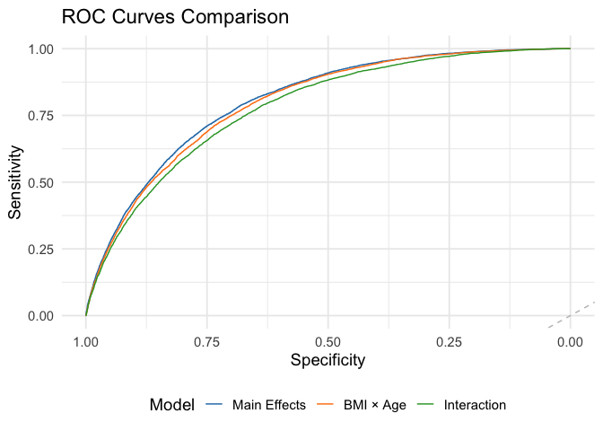<!-- -->

``` r
# Threshold Tuning
best_coords <- coords(roc_main, "best", best.method = "youden", 
                      ret = c("threshold", "specificity", "sensitivity"))

# Extract the numeric threshold safely (taking the first if there are ties)
optimal_threshold <- as.numeric(best_coords$threshold[1])
print(paste("Optimal Threshold found:", round(optimal_threshold, 4)))
```

    ## [1] "Optimal Threshold found: 0.1407"

``` r
# Generate predictions using this new threshold
preds_tuned <- factor(ifelse(probs_main > optimal_threshold, "Diabetes", "No_Diabetes"),
                      levels = c("No_Diabetes", "Diabetes"))
```

``` r
# Calculate confusion matrix stats
cm_tuned <- confusionMatrix(preds_tuned, diabetes_test$diabetes_binary, positive = "Diabetes")
print(cm_tuned)
```

    ## Confusion Matrix and Statistics
    ## 
    ##              Reference
    ## Prediction    No_Diabetes Diabetes
    ##   No_Diabetes       26408     1480
    ##   Diabetes          12467     5539
    ##                                           
    ##                Accuracy : 0.6961          
    ##                  95% CI : (0.6919, 0.7003)
    ##     No Information Rate : 0.8471          
    ##     P-Value [Acc > NIR] : 1               
    ##                                           
    ##                   Kappa : 0.2854          
    ##                                           
    ##  Mcnemar's Test P-Value : <2e-16          
    ##                                           
    ##             Sensitivity : 0.7891          
    ##             Specificity : 0.6793          
    ##          Pos Pred Value : 0.3076          
    ##          Neg Pred Value : 0.9469          
    ##              Prevalence : 0.1529          
    ##          Detection Rate : 0.1207          
    ##    Detection Prevalence : 0.3923          
    ##       Balanced Accuracy : 0.7342          
    ##                                           
    ##        'Positive' Class : Diabetes        
    ## 

``` r
# Visualizing the Confusion Matrix as a Heatmap
cm_data <- as.data.frame(cm_tuned$table)

ggplot(cm_data, aes(x = Prediction, y = Reference, fill = Freq)) +
  geom_tile(color = "white") +
  geom_text(aes(label = Freq), size = 6, color = "white") +
  scale_fill_gradient(low = "#8ebad9", high = "#0b406c") +
  labs(title = paste("Confusion Matrix (Threshold =", round(optimal_threshold, 3), ")"),
       subtitle = "Optimized for Screening (Higher Sensitivity)",
       x = "Predicted Label",
       y = "Actual Label") +
  theme_minimal(base_size = 14)
```

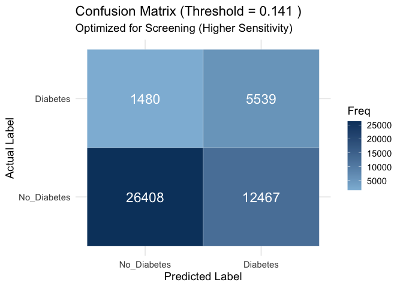<!-- -->

``` r
# Define the variables we want to keep and how to rename them
# We map the R 'term' to a 'Clean_Name'
plot_data <- tidy(logit_main) %>%
  filter(term != "(Intercept)") %>%
  mutate(
    # Create a nice label for each technical term
    Clean_Name = case_when(
      # Medical Variables
      str_detect(term, "high_bp") ~ "High Blood Pressure",
      str_detect(term, "high_chol") ~ "High Cholesterol",
      str_detect(term, "bmi_category\\.L") ~ "BMI Category (Increasing)", 
      str_detect(term, "bmi") & !str_detect(term, "category") ~ "BMI (Continuous)",
      
      # Behavioral Variables
      str_detect(term, "smoker") ~ "Smoker",
      # Note: Fruits, Veggies, Alcohol were NOT in the logit_main model formula 
      # so they won't appear here unless the model is refit. 
      # We will display what is available from the current model.
      
      # Demographic Variables
      str_detect(term, "age_cat\\.L") ~ "Age (Older)", # Keep only Linear (.L)
      str_detect(term, "income_cat\\.L") ~ "Income (Higher)", # Keep only Linear (.L)
      str_detect(term, "sexMale") ~ "Sex (Male)",
      
      # Everything else (Education, GenHlth, etc.) gets NA so we can drop it
      TRUE ~ NA_character_
    )
  ) %>%
  # Remove variables we didn't define above (GenHlth, Education, .Q, .C terms)
  filter(!is.na(Clean_Name)) %>% 
  mutate(abs_effect = abs(estimate)) %>%
  arrange(desc(abs_effect))

# Plot the filtered top predictors
ggplot(plot_data, aes(x = abs_effect, y = reorder(Clean_Name, abs_effect))) +
  geom_col(fill = "#4C9F70", width = 0.7) +
  geom_text(aes(label = round(abs_effect, 2)), hjust = -0.2, size = 4) + # Add values
  labs(title = "Key Predictors of Diabetes",
       subtitle = "Effect Size (Absolute Log-Odds)",
       x = "Impact on Diabetes Risk",
       y = NULL) +
  theme_minimal(base_size = 14) +
  theme(plot.margin = margin(10, 30, 10, 10)) + # Add room for text labels
  xlim(0, max(plot_data$abs_effect) * 1.1) # Expand x-axis slightly
```

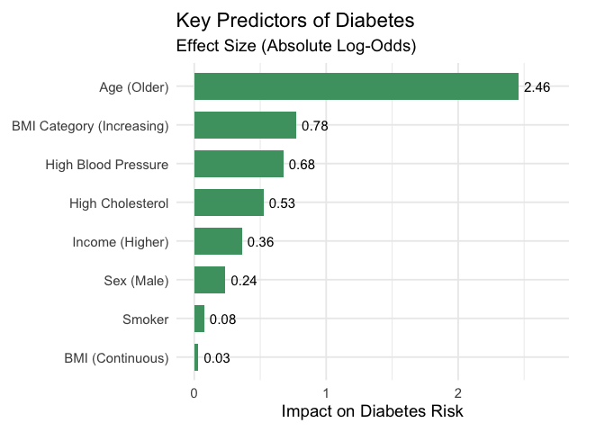<!-- -->

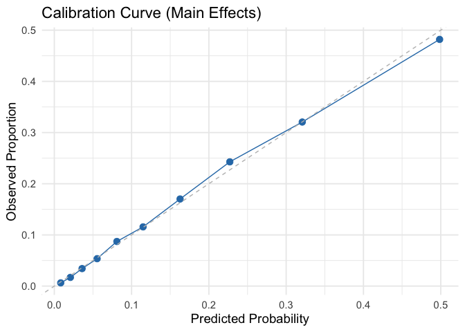<!-- -->
